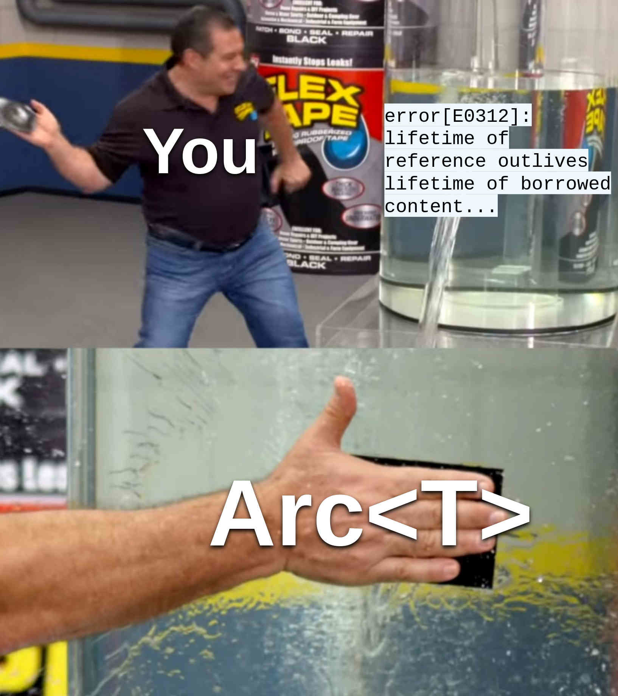

<div class="introduction">

<p class="discussions">[HN] · [r/rust] · [r/ProgrammingLanguages](https://www.reddit.com/r/ProgrammingLanguages/comments/v3clru/rust_is_hard_or_the_misery_of_mainstream/)</p>

[HN]: https://news.ycombinator.com/item?id=31601040
[r/rust]: https://www.reddit.com/r/rust/comments/v3cktw/rust_is_hard_or_the_misery_of_mainstream/


When you use Rust, it is sometimes outright preposterous how much knowledge of language, and how much of programming ingenuity and curiosity you need in order to accomplish the most trivial things. When you feel particularly desperate, you go to [rust/issues] and search for a solution for your problem. Suddenly, you find an issue with an explanation that it is theoretically impossible to design your API in this way, owing to some subtle language bug. The issue is <span style="background-color: rgb(35, 134, 54); color: white; display: inline-block; padding: 5px 12px; border-radius: 28px; font-size: 15px; font-family: sans-serif;"><svg style="vertical-align: middle; margin-bottom: 3px;" height="16" class="octicon octicon-issue-opened" viewBox="0 0 16 16" version="1.1" width="16" aria-hidden="true"><path fill="#FFFFFF" d="M8 9.5a1.5 1.5 0 100-3 1.5 1.5 0 000 3z"></path><path fill="#FFFFFF" fill-rule="evenodd" d="M8 0a8 8 0 100 16A8 8 0 008 0zM1.5 8a6.5 6.5 0 1113 0 6.5 6.5 0 01-13 0z"></path></svg> Open</span> and dated Apr 5, 2017.

[rust/issues]: https://github.com/rust-lang/rust/issues

I entered Rust four years ago. To this moment, I co-authored [teloxide] and [dptree], wrote several publications and translated a number of language release announcements. I also managed to write some production code in Rust, and had a chance to speak at one online meetup dedicated to Rust. Still, from time to time I find myself disputing with borrow checker and type system for no practical reason. Yes, I am no longer stupefied by such errors as `cannot return reference to temporary value` -- over time, I developed multiple heuristic strategies to cope with lifetimes...

But one recent situation has made me to _fail ignominiously_.

[teloxide]: https://github.com/teloxide/teloxide
[dptree]: https://github.com/teloxide/dptree

</div>

## Functions that handle updates: First try

We are programming a ~~blazing fast~~ messenger bot to make people's lives easier. Using long polling or webhooks, we obtain a stream of server updates, one-by-one. For all updates, we have a vector of handlers, each of which accepts a reference to an update and returns a future resolving to `()`. `Dispatcher` owns the handler vector and on each incoming update, it executes the handlers sequentially.

Let us try to implement this. We will omit the execution of handlers and focus only on the `push_handler` function. First try ([playground](https://play.rust-lang.org/?version=stable&mode=debug&edition=2021&gist=77fa41ad76bd47211ba3778a7c41d3ae)):

```{.rust .numberLines}
use futures::future::BoxFuture;
use std::future::Future;

#[derive(Debug)]
struct Update;

type Handler = Box<dyn for<'a> Fn(&'a Update) -> BoxFuture<'a, ()> + Send + Sync>;

struct Dispatcher(Vec<Handler>);

impl Dispatcher {
    fn push_handler<'a, H, Fut>(&mut self, handler: H)
    where
        H: Fn(&'a Update) -> Fut + Send + Sync + 'a,
        Fut: Future<Output = ()> + Send + 'a,
    {
        self.0.push(Box::new(move |upd| Box::pin(handler(upd))));
    }
}

fn main() {
    let mut dp = Dispatcher(vec![]);

    dp.push_handler(|upd| async move {
        println!("{:?}", upd);
    });
}
```

Here we represent each handler using a dynamically typed `Fn` restricted by an [HRTB lifetime] `for<'a>`, since we want a returning future to depend on some `'a` from the `&'a Update` function parameter. Later, we define the `Dispatcher` type holding `Vec<Handler>`. Inside `push_handler`, we accept a statically typed, generic `H` returning `Fut`; in order to push a value of this type to `self.0`, we need to wrap `handler` into a new boxed handler and transform the returning future to [`BoxFuture`] from the `futures` crate using [`Box::pin`]. Now let us see if the above solution works:

[HRTB lifetime]: https://doc.rust-lang.org/nomicon/hrtb.html
[`BoxFuture`]: https://docs.rs/futures/latest/futures/future/type.BoxFuture.html
[`Box::pin`]: https://doc.rust-lang.org/std/boxed/struct.Box.html#method.pin

```{.code .numberLines}
error[E0312]: lifetime of reference outlives lifetime of borrowed content...
  --> src/main.rs:17:58
   |
17 |         self.0.push(Box::new(move |upd| Box::pin(handler(upd))));
   |                                                          ^^^
   |
note: ...the reference is valid for the lifetime `'a` as defined here...
  --> src/main.rs:12:21
   |
12 |     fn push_handler<'a, H, Fut>(&mut self, handler: H)
   |                     ^^
note: ...but the borrowed content is only valid for the anonymous lifetime #1 defined here
  --> src/main.rs:17:30
   |
17 |         self.0.push(Box::new(move |upd| Box::pin(handler(upd))));
   |                              ^^^^^^^^^^^^^^^^^^^^^^^^^^^^^^^^^
```

Unfortunately, it does not work.

The reason is that `push_handler` accepts a _concrete_ lifetime `'a` that we try to boil down to an HRTB lifetime `for<'a>`. By doing so, we try to prove that `for<'a, 'b> 'a: 'b` (with `'b` being `'a` from `push_handler`), which obviously does not hold.

We can try to approach this differently: instead of the `Fut` generic, we can force a user handler to return `BoxFuture` bounded by `for<'a>` ([playground](https://play.rust-lang.org/?version=stable&mode=debug&edition=2021&gist=241de07a19e739112d57cd8ef8442db2)):

```{.rust .numberLines}
use futures::future::BoxFuture;

#[derive(Debug)]
struct Update;

type Handler = Box<dyn for<'a> Fn(&'a Update) -> BoxFuture<'a, ()> + Send + Sync>;

struct Dispatcher(Vec<Handler>);

impl Dispatcher {
    fn push_handler<H>(&mut self, handler: H)
    where
        H: for<'a> Fn(&'a Update) -> BoxFuture<'a, ()> + Send + Sync + 'static,
    {
        self.0.push(Box::new(move |upd| Box::pin(handler(upd))));
    }
}

fn main() {
    let mut dp = Dispatcher(vec![]);

    dp.push_handler(|upd| {
        Box::pin(async move {
            println!("{:?}", upd);
        })
    });
}
```

It compiles fine now but the final API is defected: ideally, we do not want a user to wrap each handler with `Box::pin`. After all, this is one of the reasons why `push_handler` exists: it transforms a statically typed handler into its functionally equivalent counterpart in the dynamic type space. But what if we force handlers to remain static?

We can accomplish it using heterogenous lists.

## Second try: Heterogenous list

A heterogenous list is indeed just a fancy name for a tuple. Thus, we want something like `(H1, H2, H3, ...)`, where each `H` is a different handler type. But at the same time, the `push_handler` and `execute` operations require us to be able to iterate on this tuple -- a possibility that is missing in vanilla Rust. It does not mean, though, that we cannot express a similar thing via some freaky type machinery!

First of all, this is the representation of our heterogenous list ([playground](https://play.rust-lang.org/?version=stable&mode=debug&edition=2021&gist=d311df0efb8136c64b19c9f783e65cd1)):

```{.rust .numberLines}
struct Dispatcher<H, Tail> {
    handler: H,
    tail: Tail,
}

struct DispatcherEnd;
```

If you think this is a bit senseless, you are not far from true. All we want is to be able to construct types like `Dispatcher<H1, Dispatcher<H2, Dispatcher<H3, DispatcherEnd>>>`, an equivalent form of the `(H1, H2, H3)` tuple. With this in mind, we can now define the `push_handler` function using simple type-level induction:

```{.rust .numberLines}
trait PushHandler<NewH> {
    type Out;
    fn push_handler(self, handler: NewH) -> Self::Out;
}

impl<NewH> PushHandler<NewH> for DispatcherEnd {
    type Out = Dispatcher<NewH, DispatcherEnd>;

    fn push_handler(self, handler: NewH) -> Self::Out {
        Dispatcher {
            handler,
            tail: DispatcherEnd,
        }
    }
}

impl<H, Tail, NewH> PushHandler<NewH> for Dispatcher<H, Tail>
where
    Tail: PushHandler<NewH>,
{
    type Out = Dispatcher<H, <Tail as PushHandler<NewH>>::Out>;

    fn push_handler(self, handler: NewH) -> Self::Out {
        Dispatcher {
            handler: self.handler,
            tail: self.tail.push_handler(handler),
        }
    }
}
```

If you are new to type-level induction, you can think of it as of regular recursion, but applied to types (traits) instead of values:

 - The **base case** is `impl<NewH> PushHandler<NewH> for DispatcherEnd`. Here we construct a dispatcher with only one handler.
 - The **step case** is `impl<H, Tail, NewH> PushHandler<NewH> for Dispatcher<H, Tail>`. Here we only propagate our induction to `self.tail`.

We implement `execute` in the same way:

```{.rust .numberLines}
trait Execute<'a> {
    #[must_use]
    fn execute(&'a self, upd: &'a Update) -> BoxFuture<'a, ()>;
}

impl<'a> Execute<'a> for DispatcherEnd {
    fn execute(&'a self, _upd: &'a Update) -> BoxFuture<'a, ()> {
        Box::pin(async {})
    }
}

impl<'a, H, Fut, Tail> Execute<'a> for Dispatcher<H, Tail>
where
    H: Fn(&'a Update) -> Fut + Send + Sync + 'a,
    Fut: Future<Output = ()> + Send + 'a,
    Tail: Execute<'a> + Send + Sync + 'a,
{
    fn execute(&'a self, upd: &'a Update) -> BoxFuture<'a, ()> {
        Box::pin(async move {
            (self.handler)(upd).await;
            self.tail.execute(upd).await;
        })
    }
}
```

But that is not all we need. The final move is to abstract `execute` _for all_ lifetimes of updates, since our implementation of `Execute<'a>` relies on some concrete `'a`, whereas we want our dispatcher to handle updates of variying lifetimes:

```{.rust .numberLines}
async fn execute<Dp>(dp: Dp, upd: Update)
where
    Dp: for<'a> Execute<'a>,
{
    dp.execute(&upd).await;
}
```

Fine, now we are ready to test our bizzare solution:

```{.rust .numberLines}
#[tokio::main]
async fn main() {
    let dp = DispatcherEnd;

    let dp = dp.push_handler(|upd| async move {
        println!("{:?}", upd);
    });
    execute(dp, Update).await;
}
```

But it does not work either:

```{.code .numberLines}
error: implementation of `Execute` is not general enough
  --> src/main.rs:83:5
   |
83 |     execute(dp, Update).await;
   |     ^^^^^^^ implementation of `Execute` is not general enough
   |
   = note: `Dispatcher<[closure@src/main.rs:80:30: 82:6], DispatcherEnd>` must implement `Execute<'0>`, for any lifetime `'0`...
   = note: ...but it actually implements `Execute<'1>`, for some specific lifetime `'1`
```

Still think that programming with borrow checker is easy and everybody can do it after some practice? Unfortunately, no matter how much practice you have, you cannot cause the above code to compile. The reason is this: the closure passed to `dp.push_handler` accepts `upd` of a _concrete_ lifetime `'1`, but `execute` requires `Dp` to implement `Execute<'0>` for _any_ lifetime `'0`, due to the HRTB bound introduced in the `where` clause. However, if you try your luck with regular functions, the code will compile:

```{.rust .numberLines}
#[tokio::main]
async fn main() {
    let dp = DispatcherEnd;

    async fn dbg_update(upd: &Update) {
        println!("{:?}", upd);
    }

    let dp = dp.push_handler(dbg_update);
    execute(dp, Update).await;
}
```

This will print `Update` to the standard output.

This particular behaviour of borrow checker may seem irrational -- and, in fact, it is; functions and closures differ not only in their respective traits but also in how they handle lifetimes. While closures that accept references are bounded by _specific_ lifetimes, functions such as our `dbg_update` accept `&'a Update` for _all_ lifetimes `'a`. This divergence is demonstrated by the following example code ([playground](https://play.rust-lang.org/?version=stable&mode=debug&edition=2021&gist=3ba11772d068d17b428029075308f405)):

```{.rust .numberLines}
let dbg_update = |upd| {
    println!("{:?}", upd);
};

{
    let upd = Update;
    dbg_update(&upd);
}

{
    let upd = Update;
    dbg_update(&upd);
}
```

Due to calls to `dbg_update`, we obtain the following compilation error:

```{.code .numberLines}
error[E0597]: `upd` does not live long enough
  --> src/main.rs:11:20
   |
11 |         dbg_update(&upd);
   |                    ^^^^ borrowed value does not live long enough
12 |     }
   |     - `upd` dropped here while still borrowed
...
16 |         dbg_update(&upd);
   |         ---------- borrow later used here
```

This is because the `dbg_update` closure can handly only one specific lifetime, whereas the lifetimes of the first and the second `upd` are clearly different.

In contrast, `dbg_update` as a function works perfectly in this scenario ([playground](https://play.rust-lang.org/?version=stable&mode=debug&edition=2021&gist=6b71d1fde5b00dd361c1e30eab6ea57c)):

```{.rust .numberLines}
fn dbg_update_fn(upd: &Update) {
    println!("{:?}", upd);
}

{
    let upd = Update;
    dbg_update_fn(&upd);
}

{
    let upd = Update;
    dbg_update_fn(&upd);
}
```

We can even trace the exact signature of this function using the handy `let () = ...;` idiom ([playground](https://play.rust-lang.org/?version=stable&mode=debug&edition=2021&gist=0901c5082bec20168439fdea93cae938)):

```{.rust .numberLines}
fn dbg_update_fn(upd: &Update) {
    println!("{:?}", upd);
}

let () = dbg_update_fn;
```

The signature is `for<'r> fn(&'r Update)`, as expected:

```{.code .numberLines}
error[E0308]: mismatched types
 --> src/main.rs:9:9
  |
9 |     let () = dbg_update_fn;
  |         ^^   ------------- this expression has type `for<'r> fn(&'r Update) {dbg_update_fn}`
  |         |
  |         expected fn item, found `()`
  |
  = note: expected fn item `for<'r> fn(&'r Update) {dbg_update_fn}`
           found unit type `()`
```

That being said, this solution with a heterogenous list is not what we want either: it is quite flummoxing, boilerplate, hacky, and does not work with closures at all. Also, I do not recommend going too far with complex type mechanics in Rust; if you suddenly encounter a type check failure somewhere near the dispatcher type, I wish you good luck. Imagine that you are maintaining a production system written in Rust and you need to fix some critical bug as quickly as possible. You introduce the necessary changes to your codebase and then see the following compilation output:

```{.code .numberLines}
error[E0308]: mismatched types
   --> src/main.rs:123:9
    |
123 |     let () = dp;
    |         ^^   -- this expression has type `Dispatcher<for<'_> fn(&Update) -> impl futures::Future<Output = ()> {dbg_update0}, Dispatcher<for<'_> fn(&Update) -> impl futures::Future<Output = ()> {dbg_update1}, Dispatcher<for<'_> fn(&Update) -> impl futures::Future<Output = ()> {dbg_update2}, Dispatcher<for<'_> fn(&Update) -> impl futures::Future<Output = ()> {dbg_update3}, Dispatcher<for<'_> fn(&Update) -> impl futures::Future<Output = ()> {dbg_update4}, Dispatcher<for<'_> fn(&Update) -> impl futures::Future<Output = ()> {dbg_update5}, Dispatcher<for<'_> fn(&Update) -> impl futures::Future<Output = ()> {dbg_update6}, Dispatcher<for<'_> fn(&Update) -> impl futures::Future<Output = ()> {dbg_update7}, Dispatcher<for<'_> fn(&Update) -> impl futures::Future<Output = ()> {dbg_update8}, Dispatcher<for<'_> fn(&Update) -> impl futures::Future<Output = ()> {dbg_update9}, DispatcherEnd>>>>>>>>>>`
    |         |
    |         expected struct `Dispatcher`, found `()`
    |
    = note: expected struct `Dispatcher<for<'_> fn(&Update) -> impl futures::Future<Output = ()> {dbg_update0}, Dispatcher<for<'_> fn(&Update) -> impl futures::Future<Output = ()> {dbg_update1}, Dispatcher<for<'_> fn(&Update) -> impl futures::Future<Output = ()> {dbg_update2}, Dispatcher<for<'_> fn(&Update) -> impl futures::Future<Output = ()> {dbg_update3}, Dispatcher<for<'_> fn(&Update) -> impl futures::Future<Output = ()> {dbg_update4}, Dispatcher<for<'_> fn(&Update) -> impl futures::Future<Output = ()> {dbg_update5}, Dispatcher<for<'_> fn(&Update) -> impl futures::Future<Output = ()> {dbg_update6}, Dispatcher<for<'_> fn(&Update) -> impl futures::Future<Output = ()> {dbg_update7}, Dispatcher<for<'_> fn(&Update) -> impl futures::Future<Output = ()> {dbg_update8}, Dispatcher<for<'_> fn(&Update) -> impl futures::Future<Output = ()> {dbg_update9}, DispatcherEnd>>>>>>>>>>`
            found unit type `()`
```

(In a real-world scenario, the above error would probably be [20x bigger].)

[20x bigger]: ../media/rust-is-hard-or-the-misery-of-mainstream-programming/teloxide-error.txt

## Third try: Using Arc



When I was novice in Rust, I used to think that references are simpler than smart pointers. Now I am using `Rc`/`Arc` almost everywhere where using lifetimes causes too much pain and performance is not a big deal. Believe or not, all of the aforementioned problems were caused by that single lifetime in `type Handler`, `'a`.

Let us just replace it with `Arc<Update>` ([playground](https://play.rust-lang.org/?version=stable&mode=debug&edition=2021&gist=f2aed7fb232e9fac8743d4986820f3d3)):

```{.rust .numberLines}
use futures::future::BoxFuture;
use std::future::Future;
use std::sync::Arc;

#[derive(Debug)]
struct Update;

type Handler = Box<dyn Fn(Arc<Update>) -> BoxFuture<'static, ()> + Send + Sync>;

struct Dispatcher(Vec<Handler>);

impl Dispatcher {
    fn push_handler<H, Fut>(&mut self, handler: H)
    where
        H: Fn(Arc<Update>) -> Fut + Send + Sync + 'static,
        Fut: Future<Output = ()> + Send + 'static,
    {
        self.0.push(Box::new(move |upd| Box::pin(handler(upd))));
    }
}

fn main() {
    let mut dp = Dispatcher(vec![]);

    dp.push_handler(|upd| async move {
        println!("{:?}", upd);
    });
}
```

Hell yeah, it compiles! We even do not need to manually specify `Arc<Update>` in each closure -- type inference will do the dirty work for us.

## The problem with Rust

"Fearless concurrency" -- a formally correct but nonetheless misleading statement. Yes, you no longer have _fear_ of data races, but you have **PAIN**, much pain.

Let me elaborate. In the previous sections, I have not even loaded you with all the peculiarities and inadequacies of Rust that affected the final solution -- but there were plenty of them. First of all, notice the heavy use of boxed futures: _all_ of the aforementioned `BoxFuture` types, as well as the corresponding `Box::new` and `Box::pin` twiddling, were irreplaceable by generics. If you know at least a little bit of Rust, you know that `Vec` can only contain fixed-sized types, so the occurrence of `BoxFuture` inside `type Handler` makes sense; however, using `BoxFuture` instead of an `async` function signature in the `Execute` trait is not that apparent.

The awesome essay _"[Why async fn in traits are hard]"_ by [Niko Matsakis] explains why. In short, at the moment of writing this blog post, it is impossible to define `async fn` functions in traits; instead you should use some type erasure alternative like the [`async-trait`] crate or boxing futures manually, as in our examples. In fact, `async-trait` performs quite a similar thing, but honestly I avoid using it because it mangles compile-time errors with procedural macros. The technique of returning `BoxFuture` also has disadvantages -- one of them is that you need not forget to specify `#[must_use]` for _each_ `async fn`, otherwise the compiler would not warn you if you call `execute` without `.await`ing it [^await-mistake]. In essence, boxing static entities is so common that the `futures` crate exposes other dynamic variants of common traits, including [`BoxStream`], [`LocalBoxFuture`], and [`LocalBoxStream`] (the last two come without the `Send` requirement).

[Why async fn in traits are hard]: https://smallcultfollowing.com/babysteps/blog/2019/10/26/async-fn-in-traits-are-hard/
[`async-trait`]: https://lib.rs/crates/async-trait
[Niko Matsakis]: https://github.com/nikomatsakis
[`BoxStream`]: https://docs.rs/futures/latest/futures/stream/type.BoxStream.html
[`LocalBoxFuture`]: https://docs.rs/futures/latest/futures/future/type.LocalBoxFuture.html
[`LocalBoxStream`]: https://docs.rs/futures/latest/futures/prelude/stream/type.LocalBoxStream.html

Secondly, explicit type annotation for `upd` breaks everything ([playground](https://play.rust-lang.org/?version=stable&mode=debug&edition=2021&gist=3b17c3a2e3f0eab0725f5762c49b1eb4)):

```{.rust .numberLines}
use tokio; // 1.18.2

#[derive(Debug)]
struct Update;

#[tokio::main]
async fn main() {
    let closure = |upd: &Update| async move {
        println!("{:?}", upd);
    };

    closure(&Update).await;
}
```

Compiler output:

```{.code .numberLines}
error: lifetime may not live long enough
  --> src/main.rs:8:34
   |
8  |       let closure = |upd: &Update| async move {
   |  _________________________-______-_^
   | |                         |      |
   | |                         |      return type of closure `impl Future<Output = ()>` contains a lifetime `'2`
   | |                         let's call the lifetime of this reference `'1`
9  | |         println!("{:?}", upd);
10 | |     };
   | |_____^ returning this value requires that `'1` must outlive `'2`
```

(Try to remove the type annotation `: &Update` and the compilation will succeed.)

If you have no idea what this error means, you are not alone -- see [issue #70791]. Looking at the list of issue labels reveals `C-Bug`, which classifies the issue as a compiler bug. At the moment of writing this post, rustc has [3,107 open `C-bug` issues] and [114 open `C-bug`+`A-lifetimes` issues]. Remember that `async fn` worked for us but an equivalent closure did not? -- this is also a compiler bug, see [issue #70263]. There are also many language-related issues dated earlier than 2020, see [issue #41078] and [issue #42940].

[issue #70791]: https://github.com/rust-lang/rust/issues/70791
[3,107 open `C-bug` issues]: https://web.archive.org/save/https://github.com/rust-lang/rust/labels/C-bug
[114 open `C-bug`+`A-lifetimes` issues]: https://web.archive.org/web/20220601185940/https://github.com/rust-lang/rust/issues?q=is%3Aopen+label%3AC-bug+label%3AA-lifetimes
[issue #70263]: https://github.com/rust-lang/rust/issues/70263
[issue #41078]: https://github.com/rust-lang/rust/issues/41078
[issue #42940]: https://github.com/rust-lang/rust/issues/42940

You see how our simple task of registering handlers has seamlessly transcended into wandering in rustc issues with the hope to somehow circumvent the language. Designing interfaces in Rust is like walking through a minefield: in order to succeed, you need to balance on your ideal interface and what features are available to you. Yes, I hear you. No, it is not like in all other languages. When you program in some stable production language (not Rust), you can typically foresee how your imaginary interface would fit with language semantics; but when you program in Rust, the process of designing APIs is affected by numerous arbitrary language limitations like those we have seen so far. You expect that borrow checker will validate your references and type system will help you to deal with program entities, but you end up throwing `Box`, `Pin`, and `Arc` here and there and fighting with type system inexpressiveness.

To finish the section, this is the full implementation in Golang:

<p class="code-annotation">`dispatcher.go`</p>

```{.go .numberLines}
package main

import "fmt"

type Update struct{}
type Handler func(*Update)

type Dispatcher struct {
	handlers []Handler
}

func (dp *Dispatcher) pushHandler(handler Handler) {
	dp.handlers = append(dp.handlers, handler)
}

func main() {
	dp := Dispatcher{handlers: nil}
	dp.pushHandler(func(upd *Update) {
		fmt.Println(upd)
	})
}
```

## Why Rust is so hard?

Sometimes it is helpful to understand why shit happens. "Because X is bad" is not an answer; "Because people that made X are bad" is not an explanation either.

So why Rust is so hard?

**Rust is a systems language.** To be a systems PL, it is very important not to hide underlying computer memory management from a programmer. For this reason, Rust pushes programmers to expose many details that would be otherwise hidden in more high-level languages. Examples: pointers, references and associated stuff, memory allocators, different string types, [different `Fn` traits], [`std::pin`], et cetera.

[different `Fn` traits]: https://en.wikipedia.org/wiki/Funarg_problem
[`std::pin`]: https://doc.rust-lang.org/std/pin/index.html

**Rust is a static language.** This is better explained in my previous essay _"[Why Static Languages Suffer From Complexity]"_. To restate, languages with static type systems (or equivalent functionality) tend to duplicate their features on their _static_ and _dynamic_ levels, thereby introducing _statics-dynamics biformity_. Transforming a static abstraction into its dynamic counterpart is called _upcasting_; the inverse process is called _downcasting_. Inside `push_handler`, we have used upcasting to turn a static handler into the dynamic `Handler` type to be pushed to the final vector.

[Why Static Languages Suffer From Complexity]: why-static-languages-suffer-from-complexity.html

In addition, Rust is committed to making all these things intuitive and memory safe. This kick-ass combination stresses the [human bounds] of computer language design. From now it should be completely understandable why Rust feels like a full of holes from time to time; in fact, it is almost a miracle that it is functioning at all. A computer language is like a system of tightly intertwined components: every time you introduce a new linguistic abstraction, you have to make sure that it plays well with the rest of the system to avoid bugs and inconsistencies. Perhaps we should grant free health insurance or other life benefits to those who develop such languages on full-time.

[human bounds]: http://www.ats-lang.org/

## How things can be different?

Now imagine that **all of Rust's issues dissapear**. Also, whole rustc and std are formally verified. It would be also fairly nice to have a complete language specification with multiple tier-1 implementations, the same support for hardware platforms as of GCC, stable ABI (though it is unclear how to deal with generics), and similar stuff. That would probably be an ideal language for systems programming.

Or imagine that **Rust's issues dissapear and it is now completely high-level**. That would kick the shit out of all mainstream programming languages. Rust has adequate defaults, it supports polymorphism, it has a very convenient package manager. I will not enumerate here all the faults of mainstream PLs: cursed JavaScript semantics, enterprise monstrosity of Java, `NULL` pointer problems in C, uncontrollable UB of C++, numerous ways of doing the same job in C#, et cetera. The modern programming language scene is rather a freak show. Yet, you see, even with all of these drawbacks, people write working software, while Rust (in its current state) is far from being the most used PL. Moreover, my prediction is that Rust will never be as popular as Java or Python. The reason is more social than technical: due to the innate complexity of the language, there will always be fewer professional software engineers in Rust than in Java or Python; to make matters even worse, they will require higher salaries, mind you. As an employer, you will have much more trouble finding good Rustaceans for your business.

Finally, imagine that **Rust's issues dissapear, it is high-level, and has uniform feature set.** That would presumably be close to the theoretical ideal of a high-level, general-purpose programming language for the masses. Funnily enough, designing such a language might turn out to be a less intimidating task than original Rust, since we can hide all low-level details under an impenetrable shell of a language runtime.

## Waiting for better future

So if I "figured out it all", why should not I develop a sublime version of Rust? I do not want to spend my next twenty years trying to do so, given that the chance that my language will stand out is infinitely small. I think the current set of most used production languages is pretty random to some extent -- we can always say why a specific language got popular, but generally we cannot explain why better alternatives sunk into oblivion. Backing from a big corporation? Accidentally targeting an IT trend of the future? Again, the reasons are rather social. Harsh reality: in life, sometimes hope plays a much more vital role than all of your skills and self-dedication.

If you still want to create a PL of the future, I wish you good luck and strong mental health. You are endlessly courageous and hopelessly romantic.


## Related ideas

 - _"[Garbage Collection Makes Rust Easier to Use: A Randomized Controlled Trial of the Bronze Garbage Collector](https://arxiv.org/pdf/2110.01098.pdf)"_
 - _"[Shifgrethor I: Garbage collection as a Rust library](https://boats.gitlab.io/blog/post/shifgrethor-i/)"_
 - _"[Revisiting a 'smaller Rust'](https://without.boats/blog/revisiting-a-smaller-rust/)"_

Feel free to contact me if you wish to extend this list.

## Update: Addressing misinterpretations

Since publication, this post has gained 500+ upvotes on [r/rust] and 700+ comments on [HN]. I did not expect such amount of attention. Unfortunately, before publishing anything, it is very hard to predict all possible misinterpretations.

Some people [pointed out](https://itsallaboutthebit.com/async-simple/) that the dispatcher example was concerned with the problems of library maintainers, and that application programmers usually do not have to deal with such peculiarities. They are right to some extent; however, the reason I wrote this essay was mainly to talk about _programming language design_.

Rust is ill-suited for generic `async` programming, this is the gross true. When you enter `async`, you observe that many other language features suddenly break down: references, closures, type system, to name a few. From the perspective of language design, this manifests a failure to design an orthogonal language [^orthogonal]. I wanted to convey this observation in my post; I should have stated this explicitly.

Additionally, how we write libraries reveals the true potential of a language, since libraries tend to require more expressive features from language designers -- due to their generic nature. This also affects mundane application programming: the more elegant libraries you have, the more easily you can solve your tasks. Example: the abscence of [GATs] does not allow you to have a generic runtime interface and change Tokio to something else in one line of code, as we do for loggers.

[GATs]: https://blog.rust-lang.org/2021/08/03/GATs-stabilization-push.html

One gentleman also outlined a [more comprehensive list](https://www.reddit.com/r/rust/comments/v3cktw/comment/ib0mp49/?utm_source=share&utm_medium=web2x&context=3) of `async` Rust failures, including function colouring, asynchronous `Drop`, and library code duplication. I did not try to address all of these issues here -- otherwise the text would be bloated with too much information. However, the list pretty much sums up all the bad things you have to deal with in generic `async` code, such as library development.

[^await-mistake]: Actually I forgot this `#[must_use]` while writing the example and then did not understand for a while why `stdout` was clean in the case of two or more chained handlers. 🤡

[^orthogonal]: A language is orthogonal when its features "play well" with each other. E.g., arrays as function parameters in C just boil down to pointers, which is admittedly not orthogonal.
