<div class="introduction">

<p class="discussions">[HN](https://news.ycombinator.com/item?id=39218173) · [r/ProgrammingLanguages](https://www.reddit.com/r/ProgrammingLanguages/comments/1agb940/solving_sat_via_positive_supercompilation/)</p>

The [boolean satisfiability problem] ("SAT" for short) is arguably the most famous NP-complete problem in theoretical computer science. According to Wikipedia, it is "the problem of determining if there exists an [interpretation] that satisfies a given [Boolean] [formula]"; or, in simpler terms, if there is at least one assignment of boolean variables to TRUE or FALSE such that the whole formula becomes TRUE.

[boolean satisfiability problem]: https://en.wikipedia.org/wiki/Boolean_satisfiability_problem
[interpretation]: https://en.wikipedia.org/wiki/Interpretation_(logic)
[Boolean]: https://en.wikipedia.org/wiki/Boolean_logic
[formula]: https://en.wikipedia.org/wiki/Well-formed_formula

As [evidenced by Victor Taelin] recently, 3-SAT (an NP-complete subset of SAT) can be encoded (and solved!) elegantly in terms of [interaction net superpositions]. Hence, it seems that certain very general computation models, such as [interaction nets], can subsume SAT if the latter is properly encoded. Inspired by the idea, I became eager to try SAT solving with perhaps the most general program transformation and optimization technique known to date: _supercompilation_.

[evidenced by Victor Taelin]: https://gist.github.com/VictorTaelin/9061306220929f04e7e6980f23ade615
[interaction net superpositions]: https://twitter.com/VictorTaelin/status/1732421137127383385
[interaction nets]: https://en.wikipedia.org/wiki/Interaction_nets

The result is mind-blowing: even a dumb supercompiler can solve arbitrary SAT formulas without the "actual" algorithm! This essay is a brief report of my findings. First, I will introduce the reader to the basics of supercompilation, then show the overall idea of solving SAT with dead code elimination, and finally demonstrate a working prototype of a supercompiler that acts as a [complete] SAT solver.

[complete]: https://en.wikipedia.org/wiki/Completeness_(logic)

Without further ado, let me begin.

</div>

## Supercompilation by example

Supercompilation is a deep program transformation technique due to [V. F. Turchin], a prominent computer scientist, cybernetician, physicist, and [Soviet dissident].

[V. F. Turchin]: https://en.wikipedia.org/wiki/Valentin_Turchin
[Soviet dissident]: https://en.wikipedia.org/wiki/Soviet_dissidents

He described the concept as follows [^supercompiler-concept]:

> A supercompiler is a program transformer of a certain type. The usual way of thinking about program transformation is in terms of some set of rules which preserve the functional meaning of the program, and a step-by-step application of these rules to the initial program. ... The concept of a supercompiler is a product of cybernetic thinking. A program is seen as a machine. To make sense of it, one must observe its operation. So a supercompiler does not transform the program by steps; it controls and observes (SUPERvises) the running of the machine that is represented by the program; let us call this machine M<sub>1</sub>. In observing the operation of M<sub>1</sub>, the supercompiler COMPILES a program which describes the activities of M<sub>1</sub>, but it makes shortcuts and whatever clever tricks it knows in order to produce the same effect as M<sub>1</sub>, but faster. The goal of the supercompiler is to make the definition of this program (machine) M<sub>2</sub> self-sufficient. When this is acheived, it outputs M<sub>2</sub> in some intermediate language L<sup>sup</sup> and simply throws away the (unchanged) machine M<sub>1</sub>.

<br>

A supercompiler is interesting not only as a program transformer but also as a very general philosophical concept:

> The supercompiler concept comes close to the way humans think and make science. We do not think in terms of rules of formal logic. We create mental and linguistic models of the reality we observe. How do we do that? We observe phenomena, generalize observations, and try to construct a self-sufficient model in terms of these generalizations. This is also what the supercompiler does. ... A supercompiler would run M<sub>1</sub>, in a general form, with unknown values of variables, and create a graph of states and transitions between possible configurations of the computing system. ... To make it finite, the supercompiler performs the operation of generalization on the system configurations in such a manner that it finally comes to a set of generalized configurations, called _basic_, in terms of which the behavior of the system can be expressed. Thus the new program becomes a self-sufficient model of the old one.

<br>

Since the above explanations are hard to comprehend at first sight, I will try to illustrate supercompilation _by example_.

Let the object language of supercompilation be a simple first-order functional language called _SLL_, which stands for _Simple Lazy Language_. It consists of:

 - **Variables:** just regular symbolic identifiers.
    - Examples: `a`, `b`, `c`.
 - **Constructors:** symbolic identifiers that wrap their arguments of arbitrary structure.
    - Examples: `Foo(a, b, c)`, `Bar(a, Foo(a), c)`.
 - **F-functions:** _indifferent_ functions that just transform their arguments.
    - Examples:
      - `foo(a, b, c) = Foo(a, b, Bar(c));`
      - `bar(a, b, c) = foo(Bar(a), b, c);`
 - **G-functions:** _curious_ functions that pattern-match on their first argument.
    - Examples: see below.

Suppose that natural numbers are represented as `Z`, `S(Z)`, `S(S(Z))`, and so on [^peano-arithmetic]. Then, we can define addition as the following g-function (from [^supercomp-main-principles]):

$$
\begin{aligned}
add(Z, y) &= y; \\
add(S(x), y) &= S(add(x, y));
\end{aligned}
$$

A supercompiler's input is a pair of an expression and program, the latter being a set of definitions of f- and g-functions. This pair is usually called a _task_.

Let the task for a hypothetic supercompiler be the expression `add(S(Z), S(S(Z)))` together with the definition of `add` above. In this case, the work of a supercompiler is as simple as sequential reduction of the initial expression to the target expression `S(S(S(Z)))`, according to the rules of `add`:

<div align="center">
   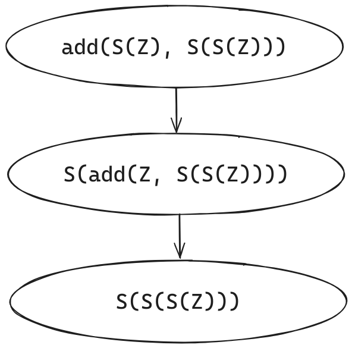
</div>

However, to think of a supercompiler as of a mere expression evaluator is a grave mistake. Let us consider what happens when it encounters a _variable_ that does not stand for some concrete expression. For example, let the task be `add(S(S(Z)), b)` with the same definition of `add`, where `b` is understood as "any" expression:

<div align="center">
   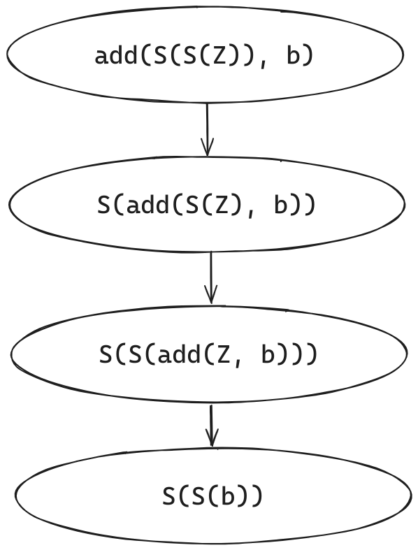
</div>

It _just_ works!

A supercompiler saw the variable `b` when trying to reduce `S(S(add(Z, b)))`, and then it just substituted `y` (from the rule `add(Z, y)`) for this `b`. After that, supercompilation has stopped because the actual expression for `b` is unknown at this point. As a result, we got `S(S(b))`, which is equivalent to the initial expression.

Now consider what happens if there is a need to _pattern-match_ on an unknown variable. In this case, we cannot just proceed with "direct" computation since there are several possibilities of the form the variable may take. Suppose that the task is `add(a, 2)` [^naturals] with the same function `add`. What a supercompiler does is that it _analyze_ the expression `add(a, 2)` according to all the possibilities of `a`, which are either `Z` or `S(v1)`, where `v1` is some fresh variable identifier. The situation looks like this:

<div align="center">
   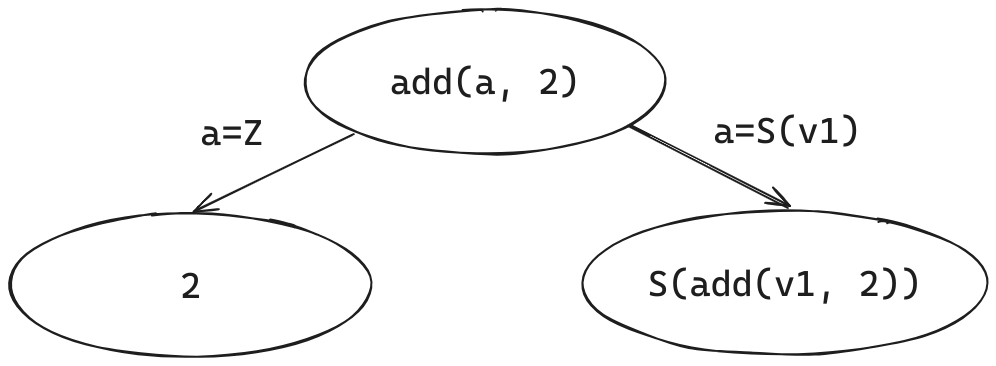
</div>

A supercompiler has built an (incomplete) _process tree_ that describes the execution of `add(a, 2)` in a general sense. In the first branch, `a` is substituted for `Z` according to the first rule of `add`; in the second branch, `a` is substituted for `S(v1)` according to the second rule of `add`. The resulting two nodes are labelled with expressions that resulted in reducing a particular substitution of the parent expression.

However, the supercompilation is not complete yet: there is still a node labelled as `S(add(v1, 2))`. A supercompiler decides to _decompose_ it, meaning to move `add(v1, 2)` out of `S(...)` in the following way:

<div align="center">
   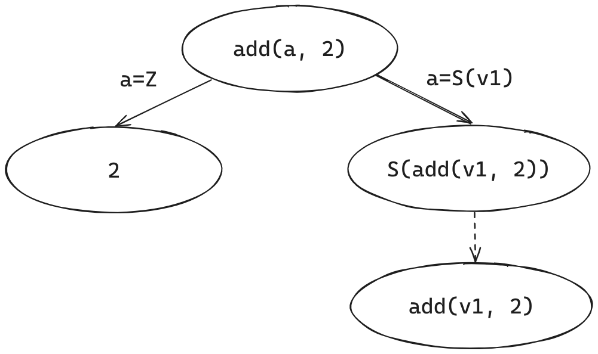
</div>

After that, if we proceed with supercompiling `add(v1, 2)`, we will eventually arrive at the initial expression `add(a, 2)`. This is because the expressions `add(v1, 2)` and `add(a, 2)` are _alpha equivalent_, meaning that they only differ in the names of variables. A supercompiler should be smart enough to detect this situation of alpha equivalence and, instead of continuing infinite supercompilation, just draw a back arrow from `add(v1, 2)` to the initial node as depicted below:

<div align="center">
   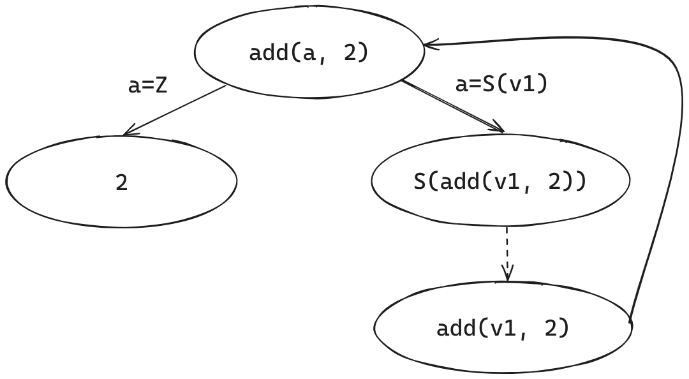
</div>

Hooray, the supercompilation of `add(a, 2)` is now complete!

What is left is to perform _residualization_ -- the process of converting a process tree to an SLL task, a _self-sufficient model_ of the initial program. Every node in the graph (except for leaf nodes) is transformed into a function whose parameters are the set of free variables from the node expression; each function is given a unique name. For example, if we see the node `add(a, 2)` pointing to `2` and `S(add(v1, 2))`, we must generate a new g-function of the following form:

$$
\begin{aligned}
g1(Z) &= \dots; \\
g1(S(v1)) &= \dots;
\end{aligned}
$$

We can complete the first branch by inserting `2` in place of `...`:

$$
\begin{aligned}
g1(Z) &= 2; \\
g1(S(v1)) &= \dots;
\end{aligned}
$$

Since the second branch leads to a node that decomposes a constructor, we generate a new f-function and call it inside `S`:

$$
\begin{aligned}
g1(Z) &= 2; \\
g1(S(v1)) &= S(f1(v1)); \\
f1(v1) &= \dots;
\end{aligned}
$$

According to the graph, the body of `f1` should be `add(v1, 2)`, but since now `add` stands for `g1`, the body will be `g1(v1)`:

$$
\begin{aligned}
g1(Z) &= 2; \\
g1(S(v1)) &= S(f1(v1)); \\
f1(v1) &= g1(v1);
\end{aligned}
$$

Since `f1` is redundant, we can inline it as follows:

$$
\begin{aligned}
g1(Z) &= 2; \\
g1(S(v1)) &= S(g1(v1));
\end{aligned}
$$

This is the final residual _program_; the residual _expression_ will be `g1(a)`, since `a` is the only free variable from the initial expression. As you can see, the definition of `g1` is simpler than the original function `add` in the sense that it accepts only one argument; the second argument has been specialized to `2` during supercompilation.

Perhaps a more interesting example would be specializing an interpreter to a concrete program, obtaining a compiled "executable". In the partial computation literature, this is called the _first Futamura projection_ [^futamura].

Consider the following interpreter `eq` (also from [^supercomp-main-principles]):

$$
\begin{aligned}
eq(Z, y) &= eqZ(y); \\
eq(S(x), y) &= eqS(y, x); \\
eqZ(Z) &= True; \\
eqZ(S(x)) &= False; \\
eqS(Z, x) &= False; \\
eqS(S(y), x) &= eq(x, y);
\end{aligned}
$$

which compares two Peano numbers for equality, resulting in either `True` or `False`.

Now consider the expression `eq(S(S(Z)), x)` with the above definition of `eq`; supercompilation will produce the following residual program:

$$
\begin{aligned}
eqZ3(Z) &= True; \\
eqZ3(S(v)) &= False; \\
eqS2(Z) &= False; \\
eqS2(S(v)) &= eqZ3(v); \\
eqS1(Z) &= False; \\
eqS1(S(v)) &= eqS2(v);
\end{aligned}
$$

together with the residual expression `eqS1(x)`. In a sense, we have obtained a compiled version of `eq` specialized to `S(S(Z))`, because `eqS1` pattern-matches only on an unknown variable `x` instead of the known "program" `S(S(Z))`.

However, supercompilation is inherently more powerful than classical partial evaluation. In Turchin's own words [^supercomp-main-principles]:

> Although supercompilation includes partial evaluation, it does not reduce to it. Supercompilation can lead to a very deep structural transformation of the original program; it can improve the program even if all the actual parameters in the function calls are variable. The supercompilation process aims at the reduction of redundancy in the original program, but this redundancy does not necessarily come from fixed values of variables; it can result from nested loops, repeated variables, and so on.

<br>

That being said, a [sufficiently smart supercompiler] can transform a two-pass list mapping into a single-pass algorithm, essentially performing _list fusion_:

[sufficiently smart supercompiler]: https://twitter.com/hirrolot/status/1741049231656280289

<div align="center">
   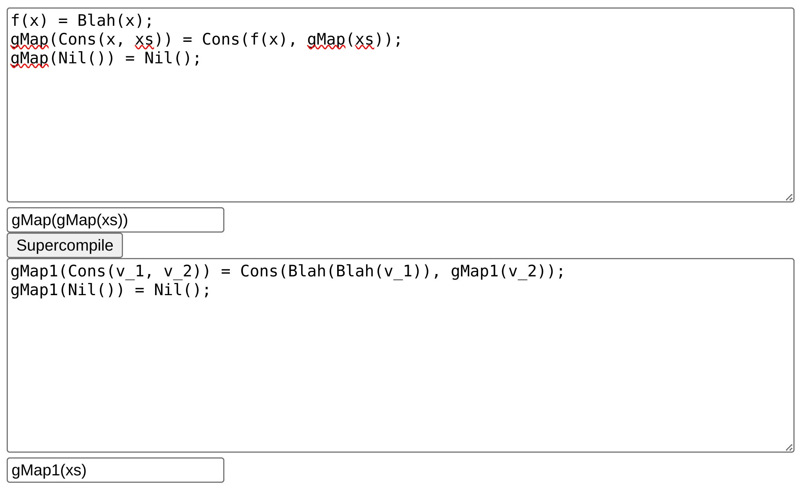
</div>

A similar example can be found in _"Rethinking Supercompilation"_ by Neil Mitchell [^rethinking-supercomp] and in [^supercompiler-concept] (section 6, _"Examples of supercompilation"_).

<hr>

Although I have deliberately skipped a few important aspects of supercompilation, most notably termination checking (see homeomorphic embedding [^homeomorphic-embedding] [^MetacompBySupercomp] [^ConvergenceSorensen]), the material presented in this section should be enough to understand the rest of the text. An interested reader may go through the references and also look into [^self-applicable-supercomp] [^metasystem-hierarchies] [^occams-razor] for some insight into a more general topic of _metacomputation_. A more thorough introduction to supercompilation can be found in [_"Supercompilation: Ideas and Methods"_] by Ilya Klyuchnikov and Dimitur Krustev.

[_"Supercompilation: Ideas and Methods"_]: https://themonadreader.files.wordpress.com/2014/04/super-final.pdf

## SAT and dead code elimination

Not let us consider how SAT can be reduced to the problem of [dead code elimination].

[dead code elimination]: https://en.wikipedia.org/wiki/Dead-code_elimination

Consider a language whose expressions are:

 - `If (x, m, n)`, where `x` is a variable, `m` and `n` are expressions.
 - `T` and `F`, which are constants.

This language is enough to encode any SAT problem. We can encode each clause in the formula as follows (in pseudocode):

$$
\begin{aligned}
OR(x, \dots) &= If (x, T, \dots); \\
OR(NOT \ x, \dots) &= If (x, \dots, T);
\end{aligned}
$$

Then `OR(x, OR(y, OR(NOT z, F)))` would correspond to "x OR y OR NOT z":

<div align="center">
   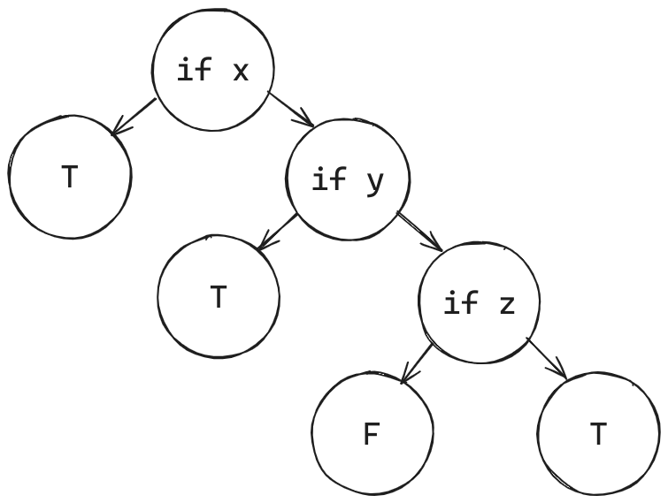
</div>

Now consider the encoding of a conjunction of clauses [^and-blowup]:

$$
\begin{aligned}
AND(If(x, m, n), \dots) &= If(x, AND(m, \dots), AND(n, \dots)); \\
AND(T, \dots) &= \dots; \\
AND(F, \dots) &= F;
\end{aligned}
$$

Then `AND(OR(x, F), AND(OR(NOT y, F), T))` would correspond to "x AND NOT y":

<div align="center">
   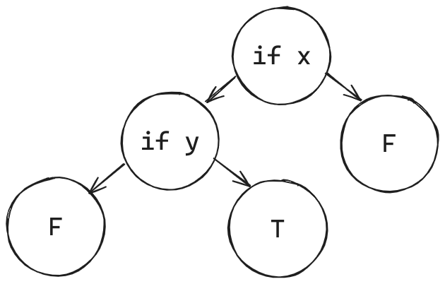
</div>

Is the formula satisfiable? Yes, because we can assign `x` to `T` and `y` to `F`.

Now consider the formula `AND(OR(x, F), AND(OR(NOT x, F), T))`, which is equivalent to "x AND NOT x":

<div align="center">
   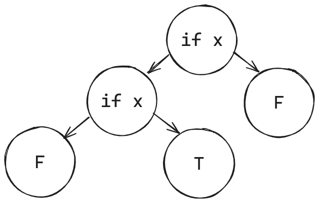
</div>

Is the formula satisfiable? To figure out, let us remove _dead paths_ from the formula:

<div align="center">
   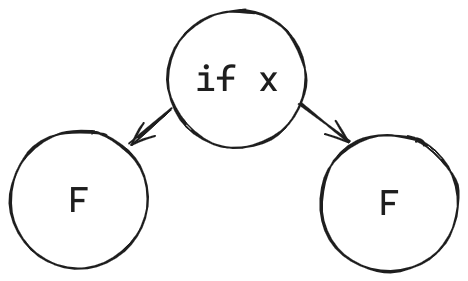
</div>

We have replaced the lower `if x` node with its first child `F` because `x` was already assigned `T` in this path. Since there are no `T` leafs in the resulting tree, it is correct to say that the formula is unsatisfiable: with any value of `x` we will arrive at `F`.

One more example is `AND(OR(x, F), AND(OR(x, OR(y, F)), AND(OR(NOT x, F), T)))`, which is equivalent to "x AND (y OR z) AND NOT x":

<div align="center">
   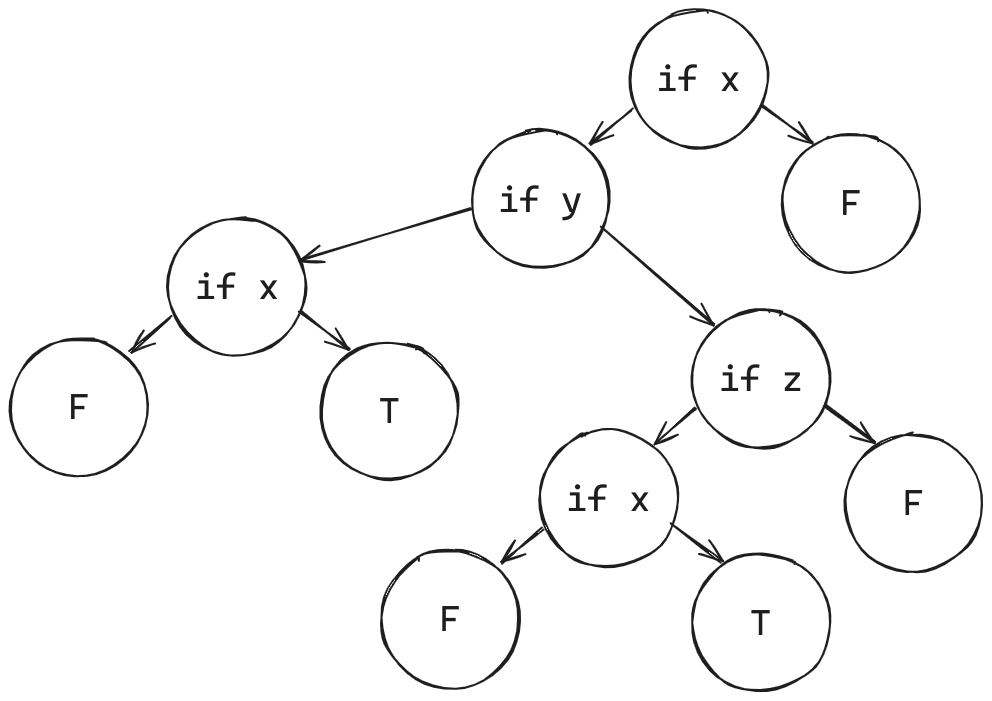
</div>

After removing dead paths:

<div align="center">
   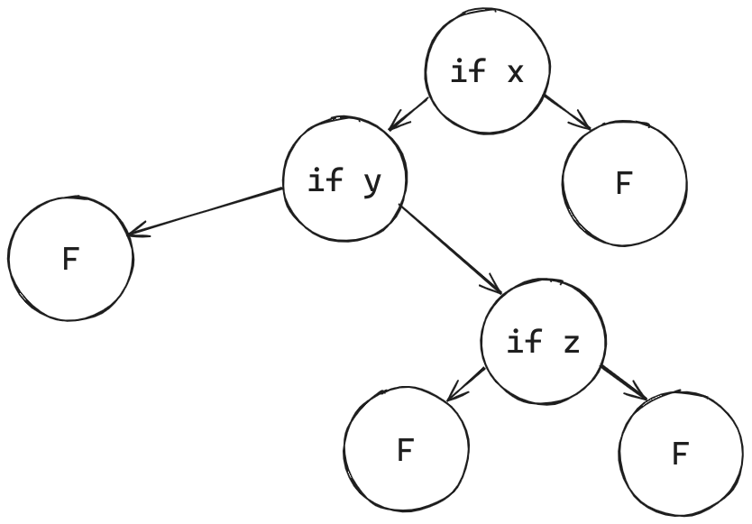
</div>

The general observation is that, after encoding a CNF formula as an if-tree and removing dead paths from it, if there is at least one `T` leaf, the initial formula is satisfiable; otherwise, the formula is unsatisfiable because there is no path from the root that will take us to `T`. Think about it for a moment.

Having this technique at our disposal, we can proceed to the key section.

## Supercompilation of SAT

_Positive supercompilation_ is a particular model of supercompilation that propagates only _positive information_ when doing case analysis. For example, when supercompiling `add(a, 2)`, a positive supercompiler will substitute (i.e., propagate) `a=Z` and `a=S(v1)` to the respective children nodes. On the other hand, _negative information_ means that some variable is _not_ equal to a particular value (or values); a typical example is the "default" case in a pattern-matching construction. A _perfect supercompiler_ is a supercompiler that is able to propagate both positive and negative information.

In this post, we only deal with positive supercompilation. Consider the schematic representation of the CNF formula “x AND NOT x” again:

<div align="center">
   
</div>

Imagine that `if`, `T`, and `F` are SLL constructors, with `if` holding three arguments: two branches and a variable, which is `T` in the first branch and `F` in the second. If we analyze the uppermost `if x`, we will get the following "process tree" [^if-process-tree]:

<div align="center">
   
</div>

Supercompilation acted as a dead code eliminator! This is because `x=T` was propagated to the first branch of the uppermost `if x`, resulting in the elimination of the branch `T` of the innermost `if x`. The second uppermost branch remains unchanged.

What if we somehow launch analysis of the whole if-tree? If so, we would essentially eliminate all dead paths from the corresponding expression, which is equivalent to solving the SAT problem! As I have mentioned in the previous section, if there is at least one `T` leaf in the final tree, the formula is satisfiable because this `T` is reachable from the root. Otherwise (if there is no `T`), the formula is unsatisfiable [^decisive-answer].

Here is a complete SAT solver written in SLL:

$$
\begin{aligned}
or(Var(x), rest) &= If(x, T, rest); \\
or(Not(x), rest) &= If(x, rest, T); \\
\\
and(If(x, m, n), rest) &= If(x, and(m, rest), and(n, rest)); \\
and(T, rest) &= rest; \\
and(F, rest) &= F; \\
\\
solve(If(x, m, n)) &= analyze(x, solve(m), solve(n)); \\
solve(T) &= T; \\
solve(F) &= F; \\
\\
analyze(T, m, n) &= m; \\
analyze(F, m, n) &= n;
\end{aligned}
$$

Without blank lines, it is 10 lines of code! This is probably the simplest (and the slowest!) SAT solver in the history of humanity.

The functions `or` and `and` are the encodings of the logical OR and AND operations, respectively. The function `solve` is the main entry point of the solver, and `analyze` is a helper function that selects one of the two branches of an `if`-expression according to the value of the first argument. Since `solve` traverses the whole expression and invokes `analyze` for each `If (x, m, n)`, all `If`-nodes in the expression are case-analyzed when `solve(formula)` is being supercompiled.

To test the solver, I will use my own [positive supercompiler written in OCaml]. The definitions of `or`, `and`, `solve`, and `analyze` will be:

[positive supercompiler written in OCaml]: https://gist.github.com/hirrolot/35e3c40e49e01cfb11d67b6bcc67b23e

```{.ocaml .numberLines}
let g_rules =
  [
    ( "or",
      [
        ( ("Var", [ "x" ]),
          [ "rest" ],
          ctr_call ("If", [ Var "x"; ctr_call ("T", []); Var "rest" ]) );
        ( ("Not", [ "x" ]),
          [ "rest" ],
          ctr_call ("If", [ Var "x"; Var "rest"; ctr_call ("T", []) ]) );
      ] );
    ( "and",
      [
        ( ("If", [ "x"; "m"; "n" ]),
          [ "rest" ],
          ctr_call
            ( "If",
              [
                Var "x";
                g_call ("and", Var "m", [ Var "rest" ]);
                g_call ("and", Var "n", [ Var "rest" ]);
              ] ) );
        (("T", []), [ "rest" ], Var "rest");
        (("F", []), [ "rest" ], ctr_call ("F", []));
      ] );
    ( "solve",
      [
        ( ("If", [ "x"; "m"; "n" ]),
          [],
          g_call
            ( "analyze",
              Var "x",
              [ g_call ("solve", Var "m", []); g_call ("solve", Var "n", []) ]
            ) );
        (("T", []), [], ctr_call ("T", []));
        (("F", []), [], ctr_call ("F", []));
      ] );
    ( "analyze",
      [ (("T", []), [ "m"; "n" ], Var "m"); (("F", []), [ "m"; "n" ], Var "n") ]
    );
  ]
```

And some helper functions in OCaml to conveniently construct CNF formulas:

```{.ocaml .numberLines}
let rec clause = function
  | `Var x :: rest -> g_call ("or", ctr_call ("Var", [ Var x ]), [ clause rest ])
  | `Not x :: rest -> g_call ("or", ctr_call ("Not", [ Var x ]), [ clause rest ])
  | [] -> ctr_call ("F", [])

let rec formula = function
  | hd :: rest -> g_call ("and", hd, [ formula rest ])
  | [] -> ctr_call ("T", [])
```

The function `check` calls `optimize`, which is supercompilation + residualization, on a given `formula`, and compares the resudual task with `expected`:

```{.ocaml .numberLines}
let check ~expected formula =
  check ~equal:[%derive.eq: string * string list]
    ~show:[%derive.show: string * string list] ~expected
    ~actual:(optimize ~g_rules (g_call ("solve", formula, [])))
```

Testing "x AND y":

```{.ocaml .numberLines}
let () =
  check
    ~expected:
      ( "g0(x, y)",
        [
          "g0(F(), y) = F()";
          "g0(T(), y) = g1(y)";
          "g1(F()) = F()";
          "g1(T()) = T()";
        ] )
    (formula [ clause [ `Var "x" ]; clause [ `Var "y" ] ]);
```

The residual function `g0` acts as the AND operation. The formula is **satisfiable**.

Testing "(x OR y) AND NOT z":

```{.ocaml .numberLines}
  check
    ~expected:
      ( "g0(x, y, z)",
        [
          "g0(F(), y, z) = g1(y, z)";
          "g0(T(), y, z) = g3(z)";
          "g1(F(), z) = F()";
          "g1(T(), z) = g2(z)";
          "g2(F()) = T()";
          "g2(T()) = F()";
          "g3(F()) = T()";
          "g3(T()) = F()";
        ] )
    (formula [ clause [ `Var "x"; `Var "y" ]; clause [ `Not "z" ] ]);
```

The formula is TRUE when either "x" or "y" are TRUE (or both), whilst "z" must always be FALSE. The formula is **satisfiable**.

Testing "(x OR NOT z) AND (y OR z OR NOT x)":

```{.ocaml .numberLines}
  check
    ~expected:
      ( "g0(x, y, z)",
        [
          "g0(F(), y, z) = g1(z, y)";
          "g0(T(), y, z) = g3(y, z)";
          "g1(F(), y) = g2(y)";
          "g1(T(), y) = F()";
          "g2(F()) = T()";
          "g2(T()) = T()";
          "g3(F(), z) = g4(z)";
          "g3(T(), z) = T()";
          "g4(F()) = F()";
          "g4(T()) = T()";
        ] )
    (formula
       [
         clause [ `Var "x"; `Not "z" ]; clause [ `Var "y"; `Var "z"; `Not "x" ];
       ]);
```

Ditto.

Testing "(a OR b) AND (NOT b OR NOT d) AND (c OR d) AND (NOT d OR NOT e) AND (e OR NOT f) AND (f OR NOT g) AND (f OR g) AND (g OR NOT p) AND (h OR NOT i) AND (NOT h OR NOT n) AND (i OR g) AND (i OR NOT g) AND (NOT g OR NOT k) AND (g OR l) AND (k OR l) AND (m OR n) AND (n OR NOT o) AND (o OR p)":

<details>
   <summary>Show the test case</summary>

```{.ocaml .numberLines}
  check
    ~expected:
      ( "g0(a, b, c, d, e, f, g, h, i, k, l, m, n, o, p)",
        [
          "g0(F(), b, c, d, e, f, g, h, i, k, l, m, n, o, p) = g1(b, c, d, e, \
           f, g, h, i, k, l, m, n, o, p)";
          "g0(T(), b, c, d, e, f, g, h, i, k, l, m, n, o, p) = g30(b, c, d, e, \
           f, g, h, i, k, l, m, n, o, p)";
          "g1(F(), c, d, e, f, g, h, i, k, l, m, n, o, p) = F()";
          "g1(T(), c, d, e, f, g, h, i, k, l, m, n, o, p) = g2(d, c, e, f, g, \
           h, i, k, l, m, n, o, p)";
          "g10(F(), h, i, k, l, m, n, o) = g11(h, i, k, l, m, n, o)";
          "g10(T(), h, i, k, l, m, n, o) = F()";
          "g11(F(), i, k, l, m, n, o) = g12(i)";
          "g11(T(), i, k, l, m, n, o) = g13(n, i, k, l, m, o)";
          "g12(F()) = F()";
          "g12(T()) = F()";
          "g13(F(), i, k, l, m, o) = g14(i, k, l, m, o)";
          "g13(T(), i, k, l, m, o) = F()";
          "g14(F(), k, l, m, o) = F()";
          "g14(T(), k, l, m, o) = g15(l, k, m, o)";
          "g15(F(), k, m, o) = F()";
          "g15(T(), k, m, o) = g16(k, m, o)";
          "g16(F(), m, o) = g17(m, o)";
          "g16(T(), m, o) = g19(m, o)";
          "g17(F(), o) = F()";
          "g17(T(), o) = g18(o)";
          "g18(F()) = F()";
          "g18(T()) = F()";
          "g19(F(), o) = F()";
          "g19(T(), o) = g20(o)";
          "g2(F(), c, e, f, g, h, i, k, l, m, n, o, p) = g3(c, e, f, g, h, i, \
           k, l, m, n, o, p)";
          "g2(T(), c, e, f, g, h, i, k, l, m, n, o, p) = F()";
          "g20(F()) = F()";
          "g20(T()) = F()";
          "g21(F(), i, k, l, m, n, o, p) = g22(i)";
          "g21(T(), i, k, l, m, n, o, p) = g23(n, i, k, l, m, o, p)";
          "g22(F()) = F()";
          "g22(T()) = F()";
          "g23(F(), i, k, l, m, o, p) = g24(i, k, l, m, o, p)";
          "g23(T(), i, k, l, m, o, p) = F()";
          "g24(F(), k, l, m, o, p) = F()";
          "g24(T(), k, l, m, o, p) = g25(k, l, m, o, p)";
          "g25(F(), l, m, o, p) = g26(l, m, o, p)";
          "g25(T(), l, m, o, p) = F()";
          "g26(F(), m, o, p) = F()";
          "g26(T(), m, o, p) = g27(m, o, p)";
          "g27(F(), o, p) = F()";
          "g27(T(), o, p) = g28(o, p)";
          "g28(F(), p) = g29(p)";
          "g28(T(), p) = F()";
          "g29(F()) = F()";
          "g29(T()) = T()";
          "g3(F(), e, f, g, h, i, k, l, m, n, o, p) = F()";
          "g3(T(), e, f, g, h, i, k, l, m, n, o, p) = g4(e, f, g, h, i, k, l, \
           m, n, o, p)";
          "g30(F(), c, d, e, f, g, h, i, k, l, m, n, o, p) = g31(c, d, e, f, \
           g, h, i, k, l, m, n, o, p)";
          "g30(T(), c, d, e, f, g, h, i, k, l, m, n, o, p) = g66(d, c, e, f, \
           g, h, i, k, l, m, n, o, p)";
          "g31(F(), d, e, f, g, h, i, k, l, m, n, o, p) = g32(d, e, f, g)";
          "g31(T(), d, e, f, g, h, i, k, l, m, n, o, p) = g36(d, e, f, g, h, \
           i, k, l, m, n, o, p)";
          "g32(F(), e, f, g) = F()";
          "g32(T(), e, f, g) = g33(e, f, g)";
          "g33(F(), f, g) = g34(f, g)";
          "g33(T(), f, g) = F()";
          "g34(F(), g) = g35(g)";
          "g34(T(), g) = F()";
          "g35(F()) = F()";
          "g35(T()) = F()";
          "g36(F(), e, f, g, h, i, k, l, m, n, o, p) = g37(e, f, g, h, i, k, \
           l, m, n, o, p)";
          "g36(T(), e, f, g, h, i, k, l, m, n, o, p) = g63(e, f, g)";
          "g37(F(), f, g, h, i, k, l, m, n, o, p) = g38(f, g)";
          "g37(T(), f, g, h, i, k, l, m, n, o, p) = g40(f, g, h, i, k, l, m, \
           n, o, p)";
          "g38(F(), g) = g39(g)";
          "g38(T(), g) = F()";
          "g39(F()) = F()";
          "g39(T()) = F()";
          "g4(F(), f, g, h, i, k, l, m, n, o, p) = g5(f, g)";
          "g4(T(), f, g, h, i, k, l, m, n, o, p) = g7(f, g, h, i, k, l, m, n, \
           o, p)";
          "g40(F(), g, h, i, k, l, m, n, o, p) = g41(g)";
          "g40(T(), g, h, i, k, l, m, n, o, p) = g42(g, h, i, k, l, m, n, o, p)";
          "g41(F()) = F()";
          "g41(T()) = F()";
          "g42(F(), h, i, k, l, m, n, o, p) = g43(p, h, i, k, l, m, n, o)";
          "g42(T(), h, i, k, l, m, n, o, p) = g54(h, i, k, l, m, n, o, p)";
          "g43(F(), h, i, k, l, m, n, o) = g44(h, i, k, l, m, n, o)";
          "g43(T(), h, i, k, l, m, n, o) = F()";
          "g44(F(), i, k, l, m, n, o) = g45(i)";
          "g44(T(), i, k, l, m, n, o) = g46(n, i, k, l, m, o)";
          "g45(F()) = F()";
          "g45(T()) = F()";
          "g46(F(), i, k, l, m, o) = g47(i, k, l, m, o)";
          "g46(T(), i, k, l, m, o) = F()";
          "g47(F(), k, l, m, o) = F()";
          "g47(T(), k, l, m, o) = g48(l, k, m, o)";
          "g48(F(), k, m, o) = F()";
          "g48(T(), k, m, o) = g49(k, m, o)";
          "g49(F(), m, o) = g50(m, o)";
          "g49(T(), m, o) = g52(m, o)";
          "g5(F(), g) = g6(g)";
          "g5(T(), g) = F()";
          "g50(F(), o) = F()";
          "g50(T(), o) = g51(o)";
          "g51(F()) = F()";
          "g51(T()) = F()";
          "g52(F(), o) = F()";
          "g52(T(), o) = g53(o)";
          "g53(F()) = F()";
          "g53(T()) = F()";
          "g54(F(), i, k, l, m, n, o, p) = g55(i)";
          "g54(T(), i, k, l, m, n, o, p) = g56(n, i, k, l, m, o, p)";
          "g55(F()) = F()";
          "g55(T()) = F()";
          "g56(F(), i, k, l, m, o, p) = g57(i, k, l, m, o, p)";
          "g56(T(), i, k, l, m, o, p) = F()";
          "g57(F(), k, l, m, o, p) = F()";
          "g57(T(), k, l, m, o, p) = g58(k, l, m, o, p)";
          "g58(F(), l, m, o, p) = g59(l, m, o, p)";
          "g58(T(), l, m, o, p) = F()";
          "g59(F(), m, o, p) = F()";
          "g59(T(), m, o, p) = g60(m, o, p)";
          "g6(F()) = F()";
          "g6(T()) = F()";
          "g60(F(), o, p) = F()";
          "g60(T(), o, p) = g61(o, p)";
          "g61(F(), p) = g62(p)";
          "g61(T(), p) = F()";
          "g62(F()) = F()";
          "g62(T()) = T()";
          "g63(F(), f, g) = g64(f, g)";
          "g63(T(), f, g) = F()";
          "g64(F(), g) = g65(g)";
          "g64(T(), g) = F()";
          "g65(F()) = F()";
          "g65(T()) = F()";
          "g66(F(), c, e, f, g, h, i, k, l, m, n, o, p) = g67(c, e, f, g, h, \
           i, k, l, m, n, o, p)";
          "g66(T(), c, e, f, g, h, i, k, l, m, n, o, p) = F()";
          "g67(F(), e, f, g, h, i, k, l, m, n, o, p) = F()";
          "g67(T(), e, f, g, h, i, k, l, m, n, o, p) = g68(e, f, g, h, i, k, \
           l, m, n, o, p)";
          "g68(F(), f, g, h, i, k, l, m, n, o, p) = g69(f, g)";
          "g68(T(), f, g, h, i, k, l, m, n, o, p) = g71(f, g, h, i, k, l, m, \
           n, o, p)";
          "g69(F(), g) = g70(g)";
          "g69(T(), g) = F()";
          "g7(F(), g, h, i, k, l, m, n, o, p) = g8(g)";
          "g7(T(), g, h, i, k, l, m, n, o, p) = g9(g, h, i, k, l, m, n, o, p)";
          "g70(F()) = F()";
          "g70(T()) = F()";
          "g71(F(), g, h, i, k, l, m, n, o, p) = g72(g)";
          "g71(T(), g, h, i, k, l, m, n, o, p) = g73(g, h, i, k, l, m, n, o, p)";
          "g72(F()) = F()";
          "g72(T()) = F()";
          "g73(F(), h, i, k, l, m, n, o, p) = g74(p, h, i, k, l, m, n, o)";
          "g73(T(), h, i, k, l, m, n, o, p) = g85(h, i, k, l, m, n, o, p)";
          "g74(F(), h, i, k, l, m, n, o) = g75(h, i, k, l, m, n, o)";
          "g74(T(), h, i, k, l, m, n, o) = F()";
          "g75(F(), i, k, l, m, n, o) = g76(i)";
          "g75(T(), i, k, l, m, n, o) = g77(n, i, k, l, m, o)";
          "g76(F()) = F()";
          "g76(T()) = F()";
          "g77(F(), i, k, l, m, o) = g78(i, k, l, m, o)";
          "g77(T(), i, k, l, m, o) = F()";
          "g78(F(), k, l, m, o) = F()";
          "g78(T(), k, l, m, o) = g79(l, k, m, o)";
          "g79(F(), k, m, o) = F()";
          "g79(T(), k, m, o) = g80(k, m, o)";
          "g8(F()) = F()";
          "g8(T()) = F()";
          "g80(F(), m, o) = g81(m, o)";
          "g80(T(), m, o) = g83(m, o)";
          "g81(F(), o) = F()";
          "g81(T(), o) = g82(o)";
          "g82(F()) = F()";
          "g82(T()) = F()";
          "g83(F(), o) = F()";
          "g83(T(), o) = g84(o)";
          "g84(F()) = F()";
          "g84(T()) = F()";
          "g85(F(), i, k, l, m, n, o, p) = g86(i)";
          "g85(T(), i, k, l, m, n, o, p) = g87(n, i, k, l, m, o, p)";
          "g86(F()) = F()";
          "g86(T()) = F()";
          "g87(F(), i, k, l, m, o, p) = g88(i, k, l, m, o, p)";
          "g87(T(), i, k, l, m, o, p) = F()";
          "g88(F(), k, l, m, o, p) = F()";
          "g88(T(), k, l, m, o, p) = g89(k, l, m, o, p)";
          "g89(F(), l, m, o, p) = g90(l, m, o, p)";
          "g89(T(), l, m, o, p) = F()";
          "g9(F(), h, i, k, l, m, n, o, p) = g10(p, h, i, k, l, m, n, o)";
          "g9(T(), h, i, k, l, m, n, o, p) = g21(h, i, k, l, m, n, o, p)";
          "g90(F(), m, o, p) = F()";
          "g90(T(), m, o, p) = g91(m, o, p)";
          "g91(F(), o, p) = F()";
          "g91(T(), o, p) = g92(o, p)";
          "g92(F(), p) = g93(p)";
          "g92(T(), p) = F()";
          "g93(F()) = F()";
          "g93(T()) = T()";
        ] )
    (formula
       [
         clause [ `Var "a"; `Var "b" ];
         clause [ `Not "b"; `Not "d" ];
         clause [ `Var "c"; `Var "d" ];
         clause [ `Not "d"; `Not "e" ];
         clause [ `Var "e"; `Not "f" ];
         clause [ `Var "f"; `Not "g" ];
         clause [ `Var "f"; `Var "g" ];
         clause [ `Var "g"; `Not "p" ];
         clause [ `Var "h"; `Not "i" ];
         clause [ `Not "h"; `Not "n" ];
         clause [ `Var "i"; `Var "g" ];
         clause [ `Var "i"; `Not "g" ];
         clause [ `Not "g"; `Not "k" ];
         clause [ `Var "g"; `Var "l" ];
         clause [ `Var "k"; `Var "l" ];
         clause [ `Var "m"; `Var "n" ];
         clause [ `Var "n"; `Not "o" ];
         clause [ `Var "o"; `Var "p" ];
       ]);
```

</details>

Ditto.

Testing "x AND NOT x":

```{.ocaml .numberLines}
  check
    ~expected:("g0(x)", [ "g0(F()) = F()"; "g0(T()) = F()" ])
    (formula [ clause [ `Var "x" ]; clause [ `Not "x" ] ]);
```

Since there is no path in `g0` that leads to `T`, the formula is **unsatisfiable**.

Testing "x AND (y OR z) AND NOT x":

```{.ocaml .numberLines}
  check
    ~expected:
      ( "g0(x, y, z)",
        [
          "g0(F(), y, z) = F()";
          "g0(T(), y, z) = g1(y, z)";
          "g1(F(), z) = g2(z)";
          "g1(T(), z) = F()";
          "g2(F()) = F()";
          "g2(T()) = F()";
        ] )
    (formula
       [
         clause [ `Var "x" ]; clause [ `Var "y"; `Var "z" ]; clause [ `Not "x" ];
       ]);
```

Ditto.

Testing "(x OR x OR x) AND (NOT x OR NOT x OR NOT x)":

```{.ocaml .numberLines}
  check
    ~expected:("g0(x)", [ "g0(F()) = F()"; "g0(T()) = F()" ])
    (formula
       [
         clause [ `Var "x"; `Var "x"; `Var "x" ];
         clause [ `Not "x"; `Not "x"; `Not "x" ];
       ]);
```

Ditto.

Testing "(x OR y OR z) AND (x OR y OR NOT z) AND (x OR NOT y OR z) AND (x OR NOT y OR NOT z) AND (NOT x OR y OR z) AND (NOT x OR y OR NOT z) AND (NOT x OR NOT y OR z) AND (NOT x OR NOT y OR NOT z)":

```{.ocaml .numberLines}
  check
    ~expected:
      ( "g0(x, y, z)",
        [
          "g0(F(), y, z) = g1(y, z)";
          "g0(T(), y, z) = g4(y, z)";
          "g1(F(), z) = g2(z)";
          "g1(T(), z) = g3(z)";
          "g2(F()) = F()";
          "g2(T()) = F()";
          "g3(F()) = F()";
          "g3(T()) = F()";
          "g4(F(), z) = g5(z)";
          "g4(T(), z) = g6(z)";
          "g5(F()) = F()";
          "g5(T()) = F()";
          "g6(F()) = F()";
          "g6(T()) = F()";
        ] )
    (formula
       [
         clause [ `Var "x"; `Var "y"; `Var "z" ];
         clause [ `Var "x"; `Var "y"; `Not "z" ];
         clause [ `Var "x"; `Not "y"; `Var "z" ];
         clause [ `Var "x"; `Not "y"; `Not "z" ];
         clause [ `Not "x"; `Var "y"; `Var "z" ];
         clause [ `Not "x"; `Var "y"; `Not "z" ];
         clause [ `Not "x"; `Not "y"; `Var "z" ];
         clause [ `Not "x"; `Not "y"; `Not "z" ];
       ])
```

Ditto.

## Final words

In this essay, I have demonstrated how supercompilation can solve any SAT problem with only 10 lines of code in SLL.

There are several theoretical and practical consequences of this discovery:

 - **Theoretically,** this means that a positive supercompiler can solve SAT "automatically" -- possibly mixed with a number of other optimizations and code transformations. In other words, it is possible that supercompilation can optimize your code based on the knowledge of a solution to a particular SAT problem.
   - A direct consequence of this is that supercompiling a particular task can have exponential time and space complexity. This is both good and bad: the good part is that supercompilation is very smart, and the bad part is that it can be _too smart_ to serve as a predictable code optimizer.
   - Since it is generally believed that there is [no polynomial-time algorithm] to solve SAT, positive supercompilation is also likely not to have it.
   - Since SAT is an [NP-complete problem], meaning that it is at least as hard as any other problem in NP, supercompilation is also at least as hard as any other problem in NP. In other words, supercompilation has enough expressive power to solve any NP problem _during the process_.
 - **Practically,** using naive supercompilation as an optimization pass would not be a good idea. However, since supercompilation is a general method rather than a particular algorithm, it should always be possible to restrict the expressive power of a _particular_ supercompiler to make it more predictable -- albeit less smart. See the technique of _speculative supercompilation_ from [^speculative-supercomp].
   - The SLL solver demonstrated in the previous section can serve as a good stress test for a practical supercompiler.

[no polynomial-time algorithm]: https://en.wikipedia.org/wiki/P_versus_NP_problem
[NP-complete problem]: https://en.wikipedia.org/wiki/NP-complete

Although the idea of supercompilation dates back to the 1970's, developing an industrial supercompiler is still an open problem.

If you find the post interesting, please share your thoughts in the comments.

## References

[^supercompiler-concept]: Valentin F. Turchin. 1986. The concept of a supercompiler. ACM Trans. Program. Lang. Syst. 8, 3 (July 1986), 292–325. https://doi.org/10.1145/5956.5957

[^peano-arithmetic]: This encoding is known as [Peano arithmetic].

[Peano arithmetic]: https://en.wikipedia.org/wiki/Peano_axioms

[^supercomp-main-principles]: Klimov, Andrei & Romanenko, Sergei. (2018). Supercompilation: main principles and basic concepts. Keldysh Institute Preprints. 1-36. 10.20948/prepr-2018-111.

[^naturals]: In the following example, `2` stands for `S(S(Z))` in Peano arithmetic.

[^futamura]: Futamura, Y. (1983). Partial computation of programs. In: Goto, E., Furukawa, K., Nakajima, R., Nakata, I., Yonezawa, A. (eds) RIMS Symposia on Software Science and Engineering. Lecture Notes in Computer Science, vol 147. Springer, Berlin, Heidelberg. https://doi.org/10.1007/3-540-11980-9_13

[^homeomorphic-embedding]: Romanenko, Sergei. (2018). Supercompilation: homeomorphic embedding, call-by-name, partial evaluation. Keldysh Institute Preprints. 1-32. 10.20948/prepr-2018-209. 

[^rethinking-supercomp]: Neil Mitchell. 2010. Rethinking supercompilation. SIGPLAN Not. 45, 9 (September 2010), 309–320. https://doi.org/10.1145/1932681.1863588

[^MetacompBySupercomp]: Robert Glück and Morten Heine Sørensen. 1996. A Roadmap to Metacomputation by Supercompilation. In Selected Papers from the International Seminar on Partial Evaluation. Springer-Verlag, Berlin, Heidelberg, 137–160.

[^ConvergenceSorensen]: Sørensen, M.H.B. (1998). Convergence of program transformers in the metric space of trees. In: Jeuring, J. (eds) Mathematics of Program Construction. MPC 1998. Lecture Notes in Computer Science, vol 1422. Springer, Berlin, Heidelberg. https://doi.org/10.1007/BFb0054297

[^self-applicable-supercomp]: Nemytykh, A.P., Pinchuk, V.A., Turchin, V.F. (1996). A Self-Applicable supercompiler. In: Danvy, O., Glück, R., Thiemann, P. (eds) Partial Evaluation. Lecture Notes in Computer Science, vol 1110. Springer, Berlin, Heidelberg. https://doi.org/10.1007/3-540-61580-6_16

[^metasystem-hierarchies]: Glück, R. (1996). On the mechanics of metasystem hierarchies in program transformation. In: Proietti, M. (eds) Logic Program Synthesis and Transformation. LOPSTR 1995. Lecture Notes in Computer Science, vol 1048. Springer, Berlin, Heidelberg. https://doi.org/10.1007/3-540-60939-3_18

[^occams-razor]: Glück, R., Klimov, A.V. (1993). Occam's razor in metacomputation: the notion of a perfect process tree. In: Cousot, P., Falaschi, M., Filé, G., Rauzy, A. (eds) Static Analysis. WSA 1993. Lecture Notes in Computer Science, vol 724. Springer, Berlin, Heidelberg. https://doi.org/10.1007/3-540-57264-3_34

[^and-blowup]: Note that this encoding results in exponential blowup in code size because the first rule propagates `...` to both branches.

[^if-process-tree]: This is not actually a process tree because `x` must be the first argument in a syntactically correct SLL expression. So in reality, the process tree would have three branches: one for `x`, the other two for `x=T` and `x=F`.

[^decisive-answer]: Of course, a residual task is not "officially" an answer to a decision problem (yes/no), but the answer can be mechanically extracted from it.

[^speculative-supercomp]: Jonsson, P. A. (2011). Time- and size-efficient supercompilation (PhD dissertation, Luleå tekniska universitet). Retrieved from https://urn.kb.se/resolve?urn=urn:nbn:se:ltu:diva-26651
