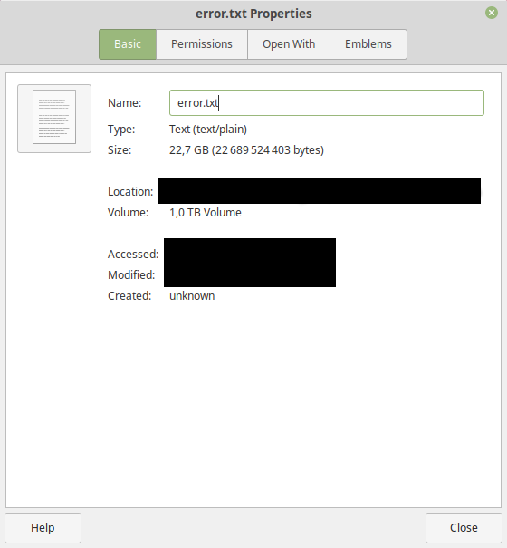
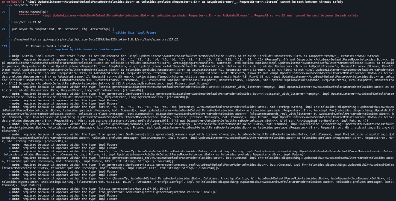
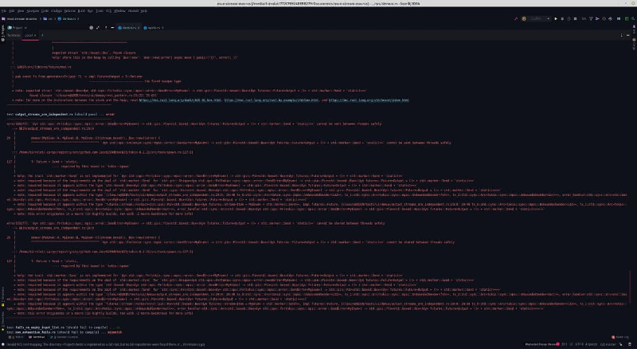
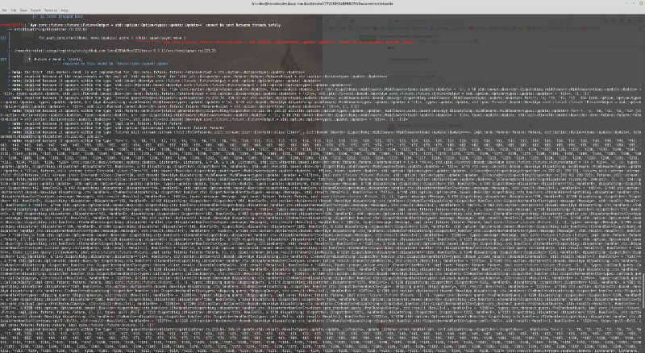
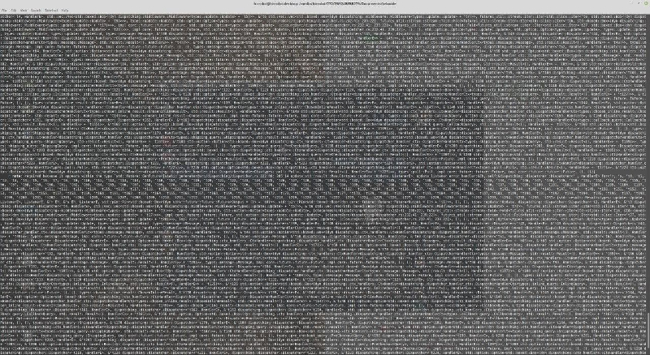
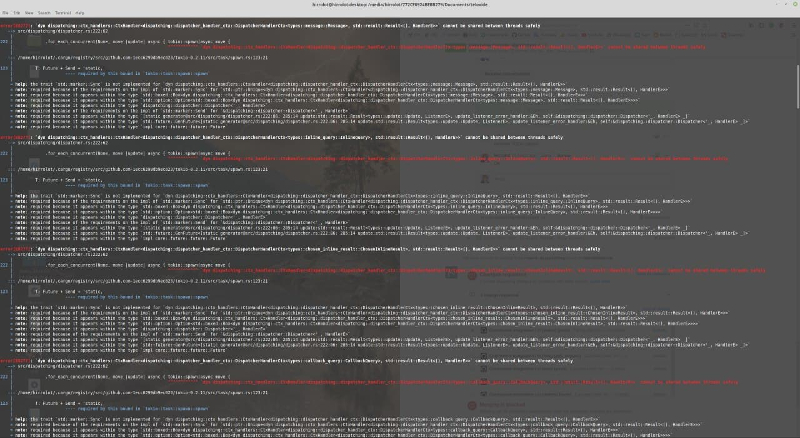

---
references:
  - id: dt99-semantics
    title: "Datatype99 code generation semantics"
    author: hirrolot
    URL: "https://github.com/hirrolot/datatype99#semantics"

  - id: if99-semantics
    title: "Interface99 code generation semantics"
    author: hirrolot
    URL: "https://github.com/hirrolot/interface99#semantics"

  - id: so-why-use-c
    title: "Why would anybody use C over C++?"
    author: Simucal
    URL: "https://stackoverflow.com/questions/497786/why-would-anybody-use-c-over-c"

  - id: dt99-why-use-c
    title: "FAQ: Why use C instead of Rust/Zig/whatever else?"
    author: hirrolot
    URL: "https://github.com/hirrolot/datatype99#q-why-use-c-instead-of-rustzigwhatever-else"

  - id: devault
    title: "Rust is not a good C replacement"
    author: Drew DeVault
    URL: "https://drewdevault.com/2019/03/25/Rust-is-not-a-good-C-replacement.html"

  - id: openssl-safestack
    title: "A use case for generics in OpenSSL"
    author: OpenSSL
    URL: "https://github.com/openssl/openssl/blob/aff636a4893e24bdc686a00a13ae6199dd38d6aa/include/openssl/safestack.h.in"

  - id: poica
    title: "A research programming language on top of C macros"
    author: hirrolot
    URL: "https://github.com/hirrolot/poica"
---

<div class="introduction">

<p class="discussions">[r/programming](https://www.reddit.com/r/programming/comments/owj32r/whats_the_point_of_the_c_preprocessor_actually/) · [r/ProgrammingLanguages](https://www.reddit.com/r/ProgrammingLanguages/comments/owhczm/whats_the_point_of_the_c_preprocessor_actually/) · [r/C_Programming](https://www.reddit.com/r/C_Programming/comments/owhbdy/whats_the_point_of_the_c_preprocessor_actually/)</p>

"To do stuff that you cannot do with functions" [^preprocessor-early-days] -- virtually every C programmer would say.

Fair. But in fact, it is a bit more complicated.

As my experience with C and programming in general grew, I recognised more and more code patterns that I write by hand... that I am forced to write by hand. Most of the time, this occurred due to inadequacies of a programming language being used.

This is especially the case with C.

In C, I quite often find myself writing [virtual tables], writing [tagged unions]... I distribute function pointers to their proper locations, I construct variants explicitly, checking whether data and a tag are consistent. In more high-level languages, these concepts are built-in; you do not need to explicitly state a memory layout, state exact instructions to construct the layout. This all is hidden under a nice interface.

[virtual tables]: https://en.wikipedia.org/wiki/Virtual_method_table
[tagged unions]: https://en.wikipedia.org/wiki/Tagged_union

We can do it in C too. _Take a look at the preprocessor_.

</div>

## Macros to the rescue!

In C, the only way to do metaprogramming is to use macros. Perhaps the reason we could not reify such abstractions as tagged unions till this moment is that C macros can only work with individual items but cannot operate on sequences thereof; put it simply, macros cannot loop or recurse. Therefore, without loops or recursion at our disposal, we could not generate something from a series of functions comprising some software interface, or from a series of variants comprising some tagged union. But we can enrich the preprocessor in such a way that it becomes possible. Read on.

[Metalang99] is the solution I came up with.

[Metalang99]: https://github.com/hirrolot/metalang99

~~Metalang99 is a language to write macros.~~ Sorry, it is a language to write recursive macros!

What was previously impossible soon became possible:

```{.c .numberLines}
datatype(
    BinaryTree,
    (Leaf, int),
    (Node, BinaryTree *, int, BinaryTree *)
);

int sum(const BinaryTree *tree) {
    match(*tree) {
        of(Leaf, x) return *x;
        of(Node, lhs, x, rhs) return sum(*lhs) + *x + sum(*rhs);
    }

    return -1;
}
```

<p class="adapted-from">Adapted from [Datatype99], a library for tagged unions.</p>

[Datatype99]: https://github.com/hirrolot/datatype99

Oh, sorry again, I am a bit sleepy today. I forgot one crucial detail: to make the following code work, you must `#include <datatype99.h>`. Let me mend myself this time:

```{.c .numberLines}
#include <interface99.h>

#define Shape_IFACE                      \
    vfunc( int, perim, const VSelf)      \
    vfunc(void, scale, VSelf, int factor)

interface(Shape);

typedef struct {
    int a, b;
} Rectangle;

int  Rectangle_perim(const VSelf) { /* ... */ }
void Rectangle_scale(VSelf, int factor) { /* ... */ }

impl(Shape, Rectangle);

typedef struct {
    int a, b, c;
} Triangle;

int  Triangle_perim(const VSelf) { /* ... */ }
void Triangle_scale(VSelf, int factor) { /* ... */ }

impl(Shape, Triangle);
```

<p class="adapted-from">Adapted from [Interface99], a library for software interfaces.</p>

[Interface99]: https://github.com/hirrolot/interface99

Everything is correct now.

Everything you need to make it work is a one-liner `#include <interface99.h>`.

Believe it or not, **this little detail is the exact purpose of the preprocessor**. Let me explain it to you: preprocessor macros are _embedded_ into the language for a reason. After all, macros are just a means for code generation, so why cannot we generate code using external tools, provided that they are often more advanced and so on? Because aside from being "advanced and so on", they are also _less natural_.

## What is wrong with external codegen?

The thing is that with native macros, you can interleave invocations thereof with the actual code, or business logic, or files in which you usually write your code. With third-party code generators, you cannot. You can only `fscanf` some code from `file.blah` and `fprintf` the generated code to `generated.h`. Okay, even if you had a ready C parser to read macro invocations of the form `X(...)` directly from `source.c`, where `X` is defined as `#define X(...) /* Consume all arguments! */` not to break the real compilation, where would you generate code? Please, do not tell me that you are going to `fprintf` right into `source.c`! Because you know, the placement of functions/types makes much sense in C, and you cannot `fprintf` the generated code for `X(...)` to `generated.h` and include it in `source.c`. The things might break apparently. And yes, you cannot just swallow the whole `source.c` and output `source-generated.c` somewhere because your IDE would then unironically say "goodbye good luck" to you -- at least, constructions generated by such macros would no longer be visible when you write code.

That is, with third-party code generators, you are forced to separate the files in which you write ordinary code from the files to be fed to the code generator.

With native macros, you write code as usual.

With native macros, you do not violate the normal order in which linguistic constructions cooperate with each other. When you write `struct Vect { ... }`, you write it in the same file as `Vect_add`, `Vect_remove`, and so on. Why should you apparently write `datatype(T, ...)` in a separate file when it is also a linguistic construction? Elaborating further, why should we treat software interfaces as an alien spacecraft fallen to Earth?

With [Datatype99] and [Interface99], you generate the stuff in-place. Tagged unions and software interfaces are those kinds of abstractions to be considered as parts of the host language, i.e., C. Therefore, they should be treated in the same way as we treat `struct`, as we treat `union`, functions, and variables.

No, I am not claiming that external codegen is useless. It has applications in a build process and other areas; for example, sometimes it is perfectly fine to separate files [@openssl-safestack]. What I am trying to convey is to use the right tool for the job. But wait, the suggested libraries rely on [some heavy-duty macros], and it is crystal clear that the vanilla C preprocessor is not meant for such kind of abuse, right?

[some heavy-duty macros]: https://github.com/hirrolot/metalang99#q-how-does-it-work

This is the turning point of our spontaneous discussion.

## The side effects of aggressive macros

Instead of thinking philosophically, I encourage you to think pragmatically.

Instead of thinking about what is good and what is bad, I encourage you to think about _benefits_ and possible _side effects_.

The **benefits** include more concise, safe, clean code.

The **side effects** _might_ include scary compilation errors and preposterous compilation times.

Not really.

When I started designing Metalang99, I was aware of how metaprogramming can go insane. _Metalang99 is an attempt to make it less insane_. With some unhealthy curiosity, you might accidentally call Satan, and he will kindly produce gigabytes of error messages for you, dear. Not kidding, I experienced it on my own:

<div align="center">

</div>

In the above error, I asked a compiler to show a full backtrace of macro expansions. Most of the time, it is just a senseless bedsheet of macro definitions, so I always turn it down by `-ftrack-macro-expansion=0` (GCC) or `-fmacro-backtrace-limit=1` (Clang).

But how to produce errors that people understand?

This question is out of the scope bla-bla-bla. I will just show you some real errors you can get from Datatype99 real quick:

<ul>

<li>
<p class="code-annotation">`playground.c`</p>

```{.c .numberLines}
datatype(A, (Foo, int), Bar(int));
```

<p class="code-annotation">`/bin/sh`</p>

```{.code .numberLines}
$ gcc playground.c -Imetalang99/include -Idatatype99 -ftrack-macro-expansion=0
playground.c:3:1: error: static assertion failed: "ML99_assertIsTuple: Bar(int) must be (x1, ..., xN)"
    3 | datatype(A, (Foo, int), Bar(int));
      | ^~~~~~~~
```
</li>

<li>
<p class="code-annotation">`playground.c`</p>

```{.c .numberLines}
datatype(A, (Foo, int) (Bar, int));
```

<p class="code-annotation">`/bin/sh`</p>

```{.code .numberLines}
$ gcc playground.c -Imetalang99/include -Idatatype99 -ftrack-macro-expansion=0
playground.c:3:1: error: static assertion failed: "ML99_assertIsTuple: (Foo, int) (Bar, int) must be (x1, ..., xN), did you miss a comma?"
    3 | datatype(A, (Foo, int) (Bar, int));
      | ^~~~~~~~
```
</li>

<li>
<p class="code-annotation">`playground.c`</p>

```{.c .numberLines}
datatype(A, (Foo, int), (Bar, int), /* trailing comma is prohibited */);
```

<p class="code-annotation">`/bin/sh`</p>

```{.code .numberLines}
$ gcc playground.c -Imetalang99/include -Idatatype99 -ftrack-macro-expansion=0
playground.c:3:1: error: static assertion failed: "ML99_assertIsTuple: must be (x1, ..., xN)"
    3 | datatype(A, (Foo, int), (Bar, int), /* trailing comma is prohibited */);
      | ^~~~~~~~
```
</li>

</ul>

Looks nice?

I know how to break this wonderful world. Look:

<p class="code-annotation">`playground.c`</p>
```{.c .numberLines}
datatype(A, (Foo, int) ~, (Bar, int));
```

<p class="code-annotation">`/bin/sh`</p>
```{.code .numberLines}
$ gcc playground.c -Imetalang99/include -Idatatype99 -ftrack-macro-expansion=0
playground.c:3:1: error: static assertion failed: "invalid term `ML99_PRIV_IF_0 ~(ML99_PRIV_listFromTuplesError, ML99_PRIV_listFromTuplesProgressAux) (DATATYPE99_PRIV_parseVariant, 2, (Foo, int) ~, (Bar, int), ~)`"
    3 | datatype(A, (Foo, int) ~, (Bar, int));
      | ^~~~~~~~
```

Looks less nice?

Bad news: it is impossible to handle all kinds of errors in macros gracefully. But we do not need to handle _all_ of them. It would be sufficient to handle _most of them_. Now I shall convince you that even Rust, a language that sells itself as a language with comprehensible errors, even Rust sometimes produces complete nonsense:



(Kindly given by [Waffle Lapkin].)

[Waffle Lapkin]: https://github.com/WaffleLapkin

<details>
    <summary>Show more hordes of errors...</summary>






(I believe some of them were on stable Rust.)

</details>

Even so, most of the time, Rust performs well enough.

Even so, most of the time, Datatype99 & Inteface99 perform well enough.

Rust exemplifies perfectly that a _system need not be ideal to be practically useful_. The same holds for the macros: I rarely see complete nonsense from my macros, but whether you like it or not, it might happen. Surely, it is not a reason to abandon the whole approach; as you can see, your computer is still there, your terminal did not die under tons of error messages, and everything you need to do is just to carefully look at the macro invocation and perhaps run your compiler with `-E` [^preprocess-only]. The funny fact is that even in Rust, I was forced to [cargo-expand] some macros several times to get a sense of what is wrong, so why no one is saying that Rusty macros are totally unusable?

[cargo-expand]: https://github.com/dtolnay/cargo-expand

Regarding compilation times, they are [just fine](https://hirrolot.github.io/posts/macros-on-steroids-or-how-can-pure-c-benefit-from-metaprogramming.html#the-compilation-times).

## Final words

Let me sum up.

The purpose of the preprocessor is to enable _seamless integration_.

The purpose of the preprocessor is to allow your macros to be conveniently interleaved with the rest of your code.

The purpose of the preprocessor is not to break the normal order in which linguistic abstractions cooperate with each other.

**The purpose of the preprocessor is to be natural**...<br>
and this is what external codegen cannot suggest, no matter how you try.

Links:

 - Installation instructions for [Metalang99](https://github.com/hirrolot/metalang99#getting-started), [Datatype99](https://github.com/hirrolot/datatype99#installation), [Interface99](https://github.com/hirrolot/interface99#installation).
 - The [motivational post] for the above libraries.
 - The [mailing list] for the above libraries. Join and talk with us!

[motivational post]: ../posts/macros-on-steroids-or-how-can-pure-c-benefit-from-metaprogramming.html
[mailing list]: https://lists.sr.ht/~hirrolot/metalang99
 
## Afterword

 - I wrote this blog post as a single answer to questions like "Your macros are nice, but the preprocessor is a wrong tool for them". I found it a logical contradiction when people appeal to one unpleasant aspect to ruin the whole approach, provided that we have several examples in the industry when the method works just fine.

 - Before I started to implement Datatype99, I searched for prior art. There were only such projects as [adt4c]. The problem with them is that they use external code generation; you can just compare how the same functionality is done using this approach and using Datatype99. Additionally, I made Datatype99 minimalistic, meaning that it provides _only_ ADTs and nothing more -- adt4c, on the contrary, comes with a type polymorphism implementation.

 - Before I started to implement Metalang99, I tried to use [Boost/Preprocessor] [@poica]. Owing to its fundamental limitations, I abandoned the project. These drawbacks include macro bluepainting (when the preprocessor blocks macro recursion) and very poor diagnostics. I fixed both of them in Metalang99.

 - Some people state that these macros (Datatype99 & Interface99) are opaque, meaning you do not know what they generate. It is simply not true; from the very beginning, I stated explicitly what they do generate [@dt99-semantics; @if99-semantics]; I do not try to fool you with a nifty interface and a bloody cannibalic massacre under the hood. I designed these libraries in such a way that they even do not require libc, they are FFI-friendly, and they do not impose any restrictions on your environment.

 - I do encourage you to use such well-documented and well-tested libraries as Datatype99 & Interface99, but I discourage you from polluting your codebase with fancy macro-based DSLs implemented upon Metalang99. Currently, I do not see much need for Metalang99 except these libraries; they provide a facade for your APIs, _reuse them_, do not try to express something by defining more macros if you can do that with already existent linguistic abstractions. If you nonetheless decided to use recursive macros of Metalang99, at least use them sanely -- always prove to yourself why you need more new macros instead of ordinary functions or/and just simpler macros, and you will thank me one day. Macros can only be a solution when you are "run out of your language"; please, do not.

 - If you ask me, "Why use C if there are Zig/Rust/C++/etc?", you can afford another language; this is cool but not always possible -- you can find the information elsewhere in the Internet [@so-why-use-c; @dt99-why-use-c; @devault].

[adt4c]: https://bitbucket.org/Macnaa/adt4c-with-polymorphism/src/master/
[Boost/Preprocessor]: http://boost.org/libs/preprocessor

## References

[^preprocessor-early-days]: I believe that the C preprocessor was initially put into the language as a temporary workaround. With the preprocessor, you can do conditional compilation, foreach-macros, generics, etc. Nowadays, most of this stuff is done by "the right tools" but back in the 70's, it was unclear how to solve such problems.

[^preprocess-only]: `-E` stands for "preprocess only". It is supported at least by GCC and Clang but other compilers should have the same option as well (probably under a different name).
