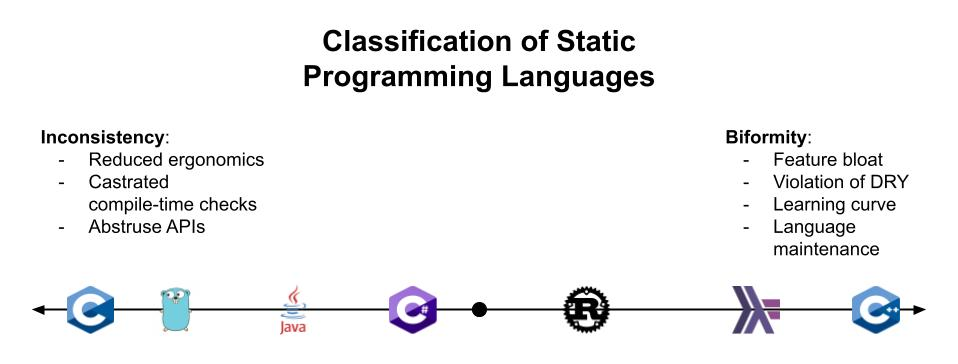
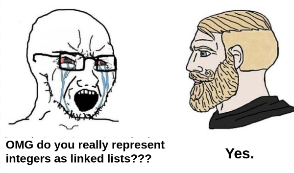
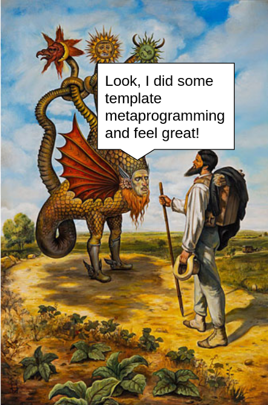
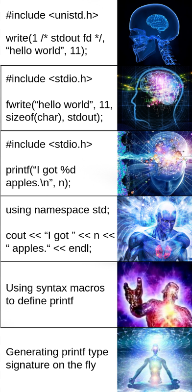
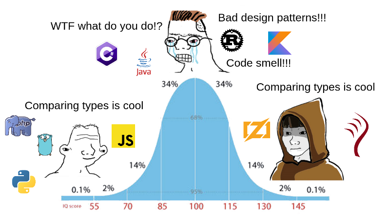

---
references:
  - id: type-dd-with-idris
    title: "Type-Driven Development with Idris"
    author: Edwin Brady
    publisher: "Manning Publications Co."
    URL: "https://www.manning.com/books/type-driven-development-with-idris"

  - id: dijkstra-pl-quote
    title: "On the teaching of programming, i.e. on the teaching of thinking"
    author: Edsger Dijkstra
    URL: "https://www.cs.utexas.edu/users/EWD/transcriptions/EWD04xx/EWD473.html"

  - id: zig-comptime-params
    title: "Introducing the Compile-Time Concept"
    author: Zig developers
    URL: "https://ziglang.org/documentation/0.9.0/#Introducing-the-Compile-Time-Concept"
---

<div class="introduction">

<p class="discussions">[HN](https://news.ycombinator.com/item?id=29996240) · [r/rust](https://www.reddit.com/r/rust/comments/s7sgxq/why_static_languages_suffer_from_complexity/) · [r/ProgrammingLanguages](https://www.reddit.com/r/ProgrammingLanguages/comments/s7shox/why_static_languages_suffer_from_complexity/)</p>



People in the programming language design community strive to make their languages more expressive, with a strong type system, mainly to increase ergonomics by avoiding code duplication in final software; however, the more expressive their languages become, the more abruptly duplication penetrates the language itself.

This is what I call **statics-dynamics biformity**: whenever you introduce a new linguistic abstraction to your language, it may reside either on the statics level, on the dynamics level, or on the both levels. In the first two cases, where the abstraction is located only on one particular level, you introduce _inconsistency_ to your language; in the latter case, you inevitably introduce the _feature biformity_.

For our purposes, the **statics level** is where all linguistic machinery is being performed at compile-time. Similarly, the **dynamics level** is where code is being executed at run-time. Thence the typical control flow operators, such as `if`/`while`/`for`/`return`, data structures, and procedures, are dynamic, whereas static type system features and syntactical macros, are static. In essence, the majority of static linguistic abstractions have their correspondence in the dynamic space and vice versa:

| Dynamics | Statics |
|----------|---------|
| Array | Record type/Tuple/[Heterogeneous list] |
| Tree (data structure) | Sum type/[Coproduct] |
| Value | Generic/[Associated type] [^type-variables] |
| Loop/recursion | Type-level induction |
| If-then-else/Pattern matching | Multiple trait implementations |
| Function signature | `trait F<In...> { type Out; }` |
| Function implementation | `impl F<...> for T { type Out = ...; }` |
| Function call | `<T as F<...>>::Out` |

[Associated type]: https://doc.rust-lang.org/rust-by-example/generics/assoc_items/types.html
[Heterogeneous list]: https://beachape.com/frunk/frunk/hlist/index.html
[Coproduct]: https://beachape.com/frunk/frunk/coproduct/index.html

In the following sections, before elaborating on the problem further, let me demonstrate to you how to implement logically equivalent programs using both the static and dynamic approaches. Most of the examples are written in Rust but can be applied to any other general-purpose programming language with enough expressive type system; keep in mind that this writeup is language-agnostic and is concerned with the _philosophy_ of [PLT] in general rather than with particular PL implementations. If you feel busy, feel free to jump right to the [main section] about the problem explanation.

[PLT]: https://en.wikipedia.org/wiki/Programming_language_theory
[main section]: #the-unfortunate-consequences-of-being-static

</div>

## Record type -- Array

Consider your everyday manipulation with record types ([playground](https://play.rust-lang.org/?version=stable&mode=debug&edition=2021&gist=945f3a2f34937369495b3733718598a5)):

<p class="code-annotation">`automobile-static.rs`</p>

```{.rust .numberLines}
struct Automobile {
    wheels: u8,
    seats: u8,
    manufacturer: String,
}

fn main() {
    let my_car = Automobile {
        wheels: 4,
        seats: 4,
        manufacturer: String::from("X"),
    };

    println!(
        "My car has {} wheels and {} seats, and it was made by {}.",
        my_car.wheels, my_car.seats, my_car.manufacturer
    );
}
```

The same can be done using arrays ([playground](https://play.rust-lang.org/?version=stable&mode=debug&edition=2021&gist=1dc3af0998b22c401a0042b081f441e1)):

<p class="code-annotation">`automobile-dynamic.rs`</p>

```{.rust .numberLines}
use std::any::Any;

#[repr(usize)]
enum MyCar {
    Wheels,
    Seats,
    Manufacturer,
}

fn main() {
    let my_car: [Box<dyn Any>; 3] = [Box::new(4), Box::new(4), Box::new("X")];

    println!(
        "My car has {} wheels and {} seats, and it was made by {}.",
        my_car[MyCar::Wheels as usize]
            .downcast_ref::<i32>()
            .unwrap(),
        my_car[MyCar::Seats as usize].downcast_ref::<i32>().unwrap(),
        my_car[MyCar::Manufacturer as usize]
            .downcast_ref::<&'static str>()
            .unwrap()
    );
}
```

Yes, if we specify an incorrect type to `.downcast_ref`, we will get a panic. But the very **logic** of the program remains the same, only we elevate type checking to run-time.

Going further, we can encode static `Automobile` as a heterogenous list:

<p class="code-annotation">`automobile-hlist.rs`</p>

```{.rust .numberLines}
use frunk::{hlist, HList};

struct Wheels(u8);
struct Seats(u8);
struct Manufacturer(String);
type Automobile = HList![Wheels, Seats, Manufacturer];

fn main() {
    let my_car: Automobile = hlist![Wheels(4), Seats(4), Manufacturer(String::from("X"))];

    println!(
        "My car has {} wheels and {} seats, and it was made by {}.",
        my_car.get::<Wheels, _>().0,
        my_car.get::<Seats, _>().0,
        my_car.get::<Manufacturer, _>().0
    );
}
```

This version enforces exactly the same type checks as `automobile-static.rs`, but additionally provides [methods] for manipulating with `type Automobile` as with ordinary collections! E.g., we may want to reverse our automobile [^missing-traits]:

[methods]: https://docs.rs/frunk/0.4.0/frunk/hlist/struct.HCons.html#implementations

```{.rust .numberLines}
assert_eq!(
    my_car.into_reverse(),
    hlist![Manufacturer(String::from("X")), Seats(4), Wheels(4)]
);
```

Or we may want to zip our car with their car:

```{.rust .numberLines}
let their_car = hlist![Wheels(6), Seats(4), Manufacturer(String::from("Y"))];

assert_eq!(
    my_car.zip(their_car),
    hlist![
        (Wheels(4), Wheels(6)),
        (Seats(4), Seats(4)),
        (Manufacturer(String::from("X")), Manufacturer(String::from("Y")))
    ]
);
```

... And so forth.

However, sometimes we may want to apply type-level computation to ordinary `struct`s and `enum`s, but we cannot do it because we are unable to extract the very structure of a type definition (fields and types/variants and their function signatures) from a corresponding type name, especially if this type is external to our crate and we cannot put a derive macro onto it [^derive-tight-coupling]. To resolve the issue, Frunk developers decided to create such a procedural macro that examines the internal structure of a type definition by implementing the [`Generic`] trait for it; it has the `type Repr` associated type, which, when implemented, equals to some form of a manipulatable heterogenous list. Still, all other types (well, transparent ones, such as [DTOs]) that do not have this derive macro, are left unexaminable, owing to the aforementioned limitations of Rust.

[`Generic`]: https://docs.rs/frunk/latest/frunk/generic/trait.Generic.html
[DTOs]: https://en.wikipedia.org/wiki/Data_transfer_object


## Sum type -- Tree

One may find sum types good to represent an AST node ([playground](https://play.rust-lang.org/?version=stable&mode=debug&edition=2021&gist=e5031b0c2888fe9ea336789ee1cdf049)):

<p class="code-annotation">`ast-static.rs`</p>

```{.rust .numberLines}
use std::ops::Deref;

enum Expr {
    Const(i32),
    Add(Box<Expr>, Box<Expr>),
    Sub(Box<Expr>, Box<Expr>),
    Mul(Box<Expr>, Box<Expr>),
    Div(Box<Expr>, Box<Expr>),
}

use Expr::*;

fn eval(expr: &Box<Expr>) -> i32 {
    match expr.deref() {
        Const(x) => *x,
        Add(lhs, rhs) => eval(&lhs) + eval(&rhs),
        Sub(lhs, rhs) => eval(&lhs) - eval(&rhs),
        Mul(lhs, rhs) => eval(&lhs) * eval(&rhs),
        Div(lhs, rhs) => eval(&lhs) / eval(&rhs),
    }
}

fn main() {
    let expr: Expr = Add(
        Const(53).into(),
        Sub(
            Div(Const(155).into(), Const(5).into()).into(),
            Const(113).into(),
        )
        .into(),
    );

    println!("{}", eval(&expr.into()));
}
```

The same can be done using tagged trees ([playground](https://play.rust-lang.org/?version=stable&mode=debug&edition=2021&gist=6da60ed991ab6e6511c4572549047f62)):

<p class="code-annotation">`ast-dynamic.rs`</p>

```{.rust .numberLines}
use std::any::Any;

struct Tree {
    tag: i32,
    value: Box<dyn Any>,
    nodes: Vec<Box<Tree>>,
}

const AST_TAG_CONST: i32 = 0;
const AST_TAG_ADD: i32 = 1;
const AST_TAG_SUB: i32 = 2;
const AST_TAG_MUL: i32 = 3;
const AST_TAG_DIV: i32 = 4;

fn eval(expr: &Tree) -> i32 {
    let lhs = expr.nodes.get(0);
    let rhs = expr.nodes.get(1);

    match expr.tag {
        AST_TAG_CONST => *expr.value.downcast_ref::<i32>().unwrap(),
        AST_TAG_ADD => eval(&lhs.unwrap()) + eval(&rhs.unwrap()),
        AST_TAG_SUB => eval(&lhs.unwrap()) - eval(&rhs.unwrap()),
        AST_TAG_MUL => eval(&lhs.unwrap()) * eval(&rhs.unwrap()),
        AST_TAG_DIV => eval(&lhs.unwrap()) / eval(&rhs.unwrap()),
        _ => panic!("Out of range"),
    }
}

fn main() {
    let expr = /* Construction omitted... */;

    println!("{}", eval(&expr));
}
```

Similarly to how we did with `struct Automobile`, we can represent `enum Expr` as [`frunk::Coproduct`]. This is left as an exercise to the reader.

[`frunk::Coproduct`]: https://beachape.com/frunk/frunk/coproduct/enum.Coproduct.html

## Value -- Associated type

We may want to negate a boolean value using the standard operator `!` ([playground](https://play.rust-lang.org/?version=nightly&mode=debug&edition=2021&gist=0dea07f96037bce0e82a2c93c77898b0)):

<p class="code-annotation">`negate-dynamic.rs`</p>

```{.rust .numberLines}
fn main() {
    assert_eq!(!true, false);
    assert_eq!(!false, true);
}
```

The same can be done through associated types [^assoc-type-bug] ([playground](https://play.rust-lang.org/?version=nightly&mode=debug&edition=2021&gist=e101a1a384390a1d502aa514b21f9954)):

<p class="code-annotation">`negate-static.rs`</p>

```{.rust .numberLines}
use std::marker::PhantomData;

trait Bool {
    type Value;
}

struct True;
struct False;

impl Bool for True { type Value = True; }
impl Bool for False { type Value = False; }

struct Negate<Cond>(PhantomData<Cond>);

impl Bool for Negate<True> {
    type Value = False;
}

impl Bool for Negate<False> {
    type Value = True;
}

const ThisIsFalse: <Negate<True> as Bool>::Value = False;
const ThisIsTrue: <Negate<False> as Bool>::Value = True;
```

In fact, the [Turing completeness of Rust's type system] is built upon this principle combined with type induction (which we shall see a bit later). Every time you see an ordinary value in terms of Rust, know that it has its formal correspondence on the type-level, in the computational sense. Every time you write some algorithm, it has its correspondence on the type-level, using conceptually equivalent constructions! If you are interested in _how_, the above article provides a **mathematical proof**: first, the author implements so-called Smallfuck using _dynamics_: a sum type, pattern matching, recursion, and then using _statics_: logic on traits, associated types, etc.

[Turing completeness of Rust's type system]: https://sdleffler.github.io/RustTypeSystemTuringComplete/

## Recursion -- Type-level induction

Let me show you one more example. But hold on tight this time ([playground](https://play.rust-lang.org/?version=stable&mode=debug&edition=2021&gist=4b13a54fa1a41d928508546ef741700e))!

<p class="code-annotation">`peano-dynamic.rs`</p>

```{.rust .numberLines}
use std::ops::Deref;

#[derive(Clone, Debug, PartialEq)]
enum Nat {
    Z,
    S(Box<Nat>),
}

fn add(lhs: &Box<Nat>, rhs: &Box<Nat>) -> Nat {
    match lhs.deref() {
        Nat::Z => rhs.deref().clone(), // I
        Nat::S(next) => Nat::S(Box::new(add(next, rhs))), // II
    }
}

fn main() {
    let one = Nat::S(Nat::Z.into());
    let two = Nat::S(one.clone().into());
    let three = Nat::S(two.clone().into());

    assert_eq!(add(&one.into(), &two.into()), three);
}
```

This is the [Peano encoding] of a natural number. In the `add` function, we use recursion to compute a sum and pattern matching to find out where to stop.

[Peano encoding]: https://en.wikipedia.org/wiki/Peano_axioms

As recursion corresponds to type induction and pattern matching corresponds to multiple implementations, the same can be done at compile-time ([playground](https://play.rust-lang.org/?version=stable&mode=debug&edition=2021&gist=d4c34d5ca2d4ea81c704aeb22a443e0f)):

<p class="code-annotation">`peano-static.rs`</p>

```{.rust .numberLines}
use std::marker::PhantomData;

struct Z;
struct S<Next>(PhantomData<Next>);

trait Add<Rhs> {
    type Result;
}

// I
impl<Rhs> Add<Rhs> for Z {
    type Result = Rhs;
}

// II
impl<Lhs: Add<Rhs>, Rhs> Add<Rhs> for S<Lhs> {
    type Result = S<<Lhs as Add<Rhs>>::Result>;
}

type One = S<Z>;
type Two = S<One>;
type Three = S<Two>;

const THREE: <One as Add<Two>>::Result = S(PhantomData);
```

Here, `impl ... for Z` is the base case (termination case), and `impl ... for S<Lhs>` is the induction step (recursion case) -- similar to how we did with pattern matching using `match`. Likewise, as in the first example, the induction works by reducing the first argument to `Z`: `<Lhs as Add<Rhs>>::Result` works just like `add(next, rhs)` -- it invokes pattern matching once again to drive the computation further. Note that the two trait implementations indeed belong to the same logical function implementation; they look detached because we perform pattern matching on our type-level number (`Z` and `S<Next>`). This is somewhat similar to what we are used to see in Haskell, where each pattern matching case looks like a separate function definition:

<p class="code-annotation">`peano-static.hs`</p>

```{.haskell .numberLines}
import Control.Exception

data Nat = Z | S Nat deriving Eq

add :: Nat -> Nat -> Nat
add Z rhs = rhs -- I
add (S next) rhs = S(add next rhs) -- II

one = S Z
two = S one
three = S two

main :: IO ()
main = assert ((add one two) == three) $ pure ()
```

## Type-level logic reified



The purpose of this writeup is only to convey the intuition behind the statics-dynamics biformity and not to provide a formal proof -- for the latter, please refer to an awesome library called [`type-operators`] (by the same person who implemented Smallfuck on types). In essence, it is an algorithmic macro eDSL that boils down to type-level manipulation with traits: you can define algebraic data types and perform data manipulations on them similar to how you normally do in Rust, but in the end, the whole code will dwell on the type-level. For more details, see the [translation rules](https://github.com/sdleffler/type-operators-rs/blob/master/src/lib.rs) and an [excellent guide](https://github.com/sdleffler/type-operators-rs/blob/master/README.md) by the same author. Another noteworthy project is [Fortraith], which is a "compile-time compiler that compiles Forth to compile-time trait expressions":

[`type-operators`]: https://crates.io/crates/type-operators
[Fortraith]: https://github.com/Ashymad/fortraith

```{.rust .numberLines}
forth!(
    : factorial (n -- n) 1 swap fact0 ;
    : fact0 (n n -- n) dup 1 = if drop else dup rot * swap pred fact0 then ;
    5 factorial .
);
```

The above code translates a simple factorial implementation to computation on traits and associated types. Later, you obtain a result as follows:

```{.rust .numberLines}
println!(
    "{}",
    <<<Empty as five>::Result as factorial>::Result as top>::Result::eval()
);
```

Having considered everything above, it is crystal clear that the **logic** part remains the same, no matter how you call it: be it statics or dynamics.

## The unfortunate consequences of being static

> Are you quite sure that all those bells and whistles, all those wonderful facilities of your so called powerful programming languages, belong to the solution set rather than the problem set?

<p class="quote-author">[Edsger Dijkstra] [@dijkstra-pl-quote]</p>

[Edsger Dijkstra]: https://en.wikipedia.org/wiki/Edsger_W._Dijkstra

Programming languages nowadays do not focus on the logic. They focus on the mechanisms inferior to logic; they call boolean negation the most simple operator that must exist from the very beginning but [negative trait bounds] are considered a debatable concept with "a lot of issues". The majority of mainstream PLs support the tree data structure in their standard libraries, but sum types [stay unimplemented for decades]. I cannot imagine a single language without the `if` operator, but only a few PLs accommodate full-fledged trait bounds, not to mention pattern matching. This is **inconsistency** -- it compels software enginners design low-quality APIs that either go dynamic and expose a very few compile-time checks or go static and try to circumvent the fundamental limitations of a host language, thereby making their usage more and more abstruse. Combining statics and dynamics in a single working solution is also complicated since you cannot invoke dynamics in a static context. In terms of [function colours], dynamics is coloured red, whereas statics is blue.

[negative trait bounds]: https://github.com/rust-lang/rfcs/issues/1834
[stay unimplemented for decades]: https://bitbashing.io/std-visit.html
[function colours]: https://journal.stuffwithstuff.com/2015/02/01/what-color-is-your-function/

In addition to this inconsistency, we have the feature **biformity**. In such languages as C++, Haskell, and Rust, this biformity amounts to the most perverse forms; you can think of any so-called "expressive" programming language as of two or more smaller languages put together: C++ the language and C++ templates/macros, Rust the language and type-level Rust + declarative macros, etc. With this approach, each time you write something at a meta-level, you cannot reuse it in the host language and vice versa, thus violating the [DRY principle] (as we shall see in a minute). Additionally, biformity increases the learning curve, hardens language evolution, and finally ends up in such a feature bloat that only the initiated can figure out what is happening in the code. Take a look at any production code in Haskell and you will immediately see those numerous GHC `#LANGUAGE` clauses, each of which signifies a separate language extension:

[DRY principle]: https://en.wikipedia.org/wiki/Don%27t_repeat_yourself

<p class="code-annotation">`feature-bloat.hs`</p>

```{.haskell .numberLines}
{-# LANGUAGE BangPatterns               #-}
{-# LANGUAGE CPP                        #-}
{-# LANGUAGE ConstraintKinds            #-}
{-# LANGUAGE DefaultSignatures          #-}
{-# LANGUAGE DeriveAnyClass             #-}
{-# LANGUAGE DeriveGeneric              #-}
{-# LANGUAGE DerivingStrategies         #-}
{-# LANGUAGE FlexibleContexts           #-}
{-# LANGUAGE FlexibleInstances          #-}
{-# LANGUAGE GADTs                      #-}
{-# LANGUAGE GeneralizedNewtypeDeriving #-}
{-# LANGUAGE NamedFieldPuns             #-}
{-# LANGUAGE OverloadedStrings          #-}
{-# LANGUAGE PolyKinds                  #-}
{-# LANGUAGE RecordWildCards            #-}
{-# LANGUAGE ScopedTypeVariables        #-}
{-# LANGUAGE TypeFamilies               #-}
{-# LANGUAGE UndecidableInstances       #-}
{-# LANGUAGE ViewPatterns               #-}
```

<p class="adapted-from">Adapted from [haskell/haskell-language-server].</p>

[haskell/haskell-language-server]: https://github.com/haskell/haskell-language-server/blob/ee0a0cc78352c961f641443eea89a26b9e1d3974/hls-plugin-api/src/Ide/Types.hs

When a host language does not provide enough static capabilities needed for convenient development, some programmers go especially insane and create whole new compile-time metalanguages and eDSLs atop of existing ones. Thus, **inconsistency has the treacherous property of transforming into biformity**:

<ul>
<li>

[**C++**] We have [template metaprogramming] libraries, such as [Boost/Hana] and [Boost/MPL], which copy the functionality of C++ to be used at a meta-level:


[template metaprogramming]: https://en.wikipedia.org/wiki/Template_metaprogramming
[Boost/Hana]: https://github.com/boostorg/hana
[Boost/MPL]: https://github.com/boostorg/mpl

<p class="code-annotation">`take_while.cpp`</p>

```{.cpp .numberLines}
BOOST_HANA_CONSTANT_CHECK(
    hana::take_while(hana::tuple_c<int, 0, 1, 2, 3>, hana::less.than(2_c))
    ==
    hana::tuple_c<int, 0, 1>
);
```

<p class="adapted-from">Adapted from [hana/example/take_while.cpp].</p>

[hana/example/take_while.cpp]: https://github.com/boostorg/hana/blob/998033e9dba8c82e3c9496c274a3ad1acf4a2f36/example/take_while.cpp

<p class="code-annotation">`filter.cpp`</p>

```{.cpp .numberLines}
constexpr auto is_integral =
    hana::compose(hana::trait<std::is_integral>, hana::typeid_);

static_assert(
    hana::filter(hana::make_tuple(1, 2.0, 3, 4.0), is_integral)
    == hana::make_tuple(1, 3), "");
static_assert(
    hana::filter(hana::just(3), is_integral)
    == hana::just(3), "");
BOOST_HANA_CONSTANT_CHECK(
    hana::filter(hana::just(3.0), is_integral) == hana::nothing);
```

<p class="adapted-from">Adapted from [hana/example/filter.cpp].</p>

[hana/example/filter.cpp]: https://github.com/boostorg/hana/blob/998033e9dba8c82e3c9496c274a3ad1acf4a2f36/example/filter.cpp

<p class="code-annotation">`iter_fold.cpp`</p>

```{.cpp .numberLines}
typedef vector_c<int, 5, -1, 0, 7, 2, 0, -5, 4> numbers;
typedef iter_fold<
    numbers,
    begin<numbers>::type,
    if_<less<deref<_1>, deref<_2>>, _2, _1>
>::type max_element_iter;

BOOST_MPL_ASSERT_RELATION(
    deref<max_element_iter>::type::value, ==, 7);
```

<p class="adapted-from">Adapted from [the docs of MPL].</p>

[the docs of MPL]: https://www.boost.org/doc/libs/1_78_0/libs/mpl/doc/refmanual/iter-fold.html

</li>
<li>

[**C**] My own compile-time metaprogramming framework [Metalang99] does the same job by (ab)using the C preprocessor. It came to such extent that I was forced to literally [re-implement recursion] through the combination of a Lisp-like trampoline and [Continuation-Passing Style (CPS)] techniques. In the end, I had a cornucopia of list functions in the standard library, such as [`ML99_listMap`], [`ML99_listIntersperse`], and [`ML99_listFoldr`], which arguably makes Metalang99, as a pure data transformation language, more expressive than C itself [^boost-preprocessor].

[Metalang99]: https://github.com/hirrolot/metalang99
[re-implement recursion]: https://github.com/hirrolot/metalang99/blob/master/include/metalang99/eval/rec.h
[Continuation-Passing Style (CPS)]: https://en.wikipedia.org/wiki/Continuation-passing_style
[`ML99_listMap`]: https://metalang99.readthedocs.io/en/latest/list.html#c.ML99_listMap
[`ML99_listIntersperse`]: https://metalang99.readthedocs.io/en/latest/list.html#c.ML99_listIntersperse
[`ML99_listFoldr`]: https://metalang99.readthedocs.io/en/latest/list.html#c.ML99_listFoldr

</li>
<li>

[**Rust**] In the first example of inconsistency (`Automobile`), we used a heterogenous list from the [Frunk] library. It is of no difficulty to see that Frunk [duplicates](https://github.com/lloydmeta/frunk/blob/master/core/src/hlist.rs) some of the functionality of collections and iterators just to elevate them to type-level. It could be cool to apply `Iterator::map` or `Iterator::intersperse` to heterogenous lists, but we cannot. Even worse, if we nevertheless want to perform declarative type-level data transformations, we have to maintain the 1-to-1 correspondence between the iterator adaptors and those of type-level; each time a
 new utility is implemented for iterators, we have one utility missing in `hlist`.

[Frunk]: https://docs.rs/frunk/latest/frunk/index.html

</li>
<li>

[**Rust**] [Typenum] is yet another popular type-level library: it performs integral calculations at compile-time, by encoding integers as generics [^recall-generics-correspondence]. By doing this, the part of the language responsible for integers finds its counterpart in the statics, thereby introducing even more biformity [^const-generics]. We cannot just parameterise some type with `(2 + 2) * 5`, we have to write something like `<<P2 as Add<P2>>::Output as Mul<P5>>::Output`! The best thing you could do is to write a macro that does the dirty job for you, but it would only be syntax sugar -- you would anyway see hordes of compile-time errors with the aforementioned traits.

[Typenum]: https://docs.rs/typenum/latest/typenum/

</li>
</ul>



Sometimes, software engineers find their languages too primitive to express their ideas even in dynamic code. But they do not give up:

 - [**Golang**] [Kubernetes], one of the largest codebases in Golang, has its own [object-oriented type system] implemented in the [`runtime` package].

[Kubernetes]: https://github.com/kubernetes/kubernetes
[object-oriented type system]: https://medium.com/@arschles/go-experience-report-generics-in-kubernetes-25da87430301
[`runtime` package]: https://pkg.go.dev/k8s.io/apimachinery/pkg/runtime

 - [**C**] The [VLC media player] has a macro-based [plugin API] used to represent media codecs. Here is how [Opus is defined].

[VLC media player]: https://github.com/videolan/vlc
[plugin API]: https://github.com/videolan/vlc/blob/271d3552b7ad097d796bc431e946931abbe15658/include/vlc_plugin.h
[Opus is defined]: https://github.com/videolan/vlc/blob/271d3552b7ad097d796bc431e946931abbe15658/modules/codec/opus.c#L57

 - [**C**] The [QEMU machine emulator] is built upon their custom [object model](https://github.com/qemu/qemu/tree/master/include/qapi/qmp): `QObject`, `QNum`, `QNull`, `QList`, `QString`, `QDict`, `QBool`, etc.

[QEMU machine emulator]: https://github.com/qemu/qemu

Recalling the famous [Greenspun's tenth rule], such handmade metalanguages are typically "ad-hoc, informally-specified, bug-ridden, and slow", with quite vague semantics and awful documentation. The concept of a [metalinguistic abstraction] simply does not work, albeit the rationale of creating highly declarative, small domain-specific languages sounds so cool at first sight. When a problem domain (or some intermediate machinery) is expressed in terms of a host language, you need to understand how to chain function calls together to get things done -- this is what we usually call an API; however, when this API is written in another language, then, in addition to the calling sequence, you need to understand the syntax and semantics of that language, which is very unfortunate for two reasons: the mental burden it lays upon developers and a very limited number of developers that can support such metalanguages. From my experience, handmade metalinguistics tend to quickly go out of hand and spread across the whole codebase, thereby making it harder to dig into. Not only reasoning is impaired but also compiler-developer interaction: have you ever tried to use a sophisticated type or macro API? If yes, then you should be perfectly acquainted with inscrutable compiler diagnostics, which can be summarised in the following screenshot [^teloxide-error-message]:

[Greenspun's tenth rule]: https://en.wikipedia.org/wiki/Greenspun%27s_tenth_rule
[metalinguistic abstraction]: https://en.wikipedia.org/wiki/Metalinguistic_abstraction


This is woefully to say, but it seems that an "expressive" PL nowadays means "Hey there, I have seriously messed up with the number of features, but that is fine!"

Finally, a word has to be said about metaprogramming in a host language. With such templating systems as [Template Haskell] and [Rust's procedural macros], we can manipulate an AST [^is-true-ast] of a host language using the same language, which is good in terms of biformity but unpleasant in terms of general language inconsistency. Macros are not functions: we cannot partially apply a macro and obtain a partially applied function (or vice versa), since they are just different concepts -- this can turn out to be a pain in the ass if we are to design a generic and easy-to-use library API. Personally, I do think that procedural macros in Rust are a **giant design mistake** that is comparable to `#define` macros in plain C: aside from pure syntax, the macro system simply has no idea about the language being manipulated; instead of a tool to extend and work with a language gracefully, you get slightly enhanced text substitution and nothing more [^text-subst]. E.g., imagine there is an enumeration called `Either`, whose definition is as follows:

[Template Haskell]: https://wiki.haskell.org/A_practical_Template_Haskell_Tutorial
[Rust's procedural macros]: https://doc.rust-lang.org/reference/procedural-macros.html

<p class="code-annotation">`either.rs`</p>

```{.rust .numberLines}
pub enum Either<L, R> {
    Left(L),
    Right(R),
}
```

<p class="adapted-from">Adapted from [either::Either].</p>

[either::Either]: https://docs.rs/either/latest/either/enum.Either.html

Now imagine we have an arbitrary trait `Foo`, and we are willing to implement this trait for `Either<L, R>`, where `L` and `R` both implement `Foo`. It turns out that we cannot apply a derive macro to `Either` that implements this trait, even if the name is known because, in order to do this, this macro must know all the signatures of `Foo`. To make the situation even worse, `Foo` may be defined in a separate library, meaning that we cannot augment its definition with extra meta-information needed for the derivation for `Either<L, R>`. While it may seem as a rare scanario, in fact it is not; I highly encourage you to look at [tokio-util]'s [`Either`](https://docs.rs/tokio-util/latest/tokio_util/either/enum.Either.html), which is **exactly** the same enumeration but it implements Tokio-specific traits, such as `AsyncRead`, `AsyncWrite`, `AsyncSeek`, etc [^my-tokio-either]. ~~Now imagine you have five different `Either`s in your project that came from different libraries -- that would be a true integration headache!~~ [^tokio-either-update] While type introspection may be a compromise, it would nonetheless make the language even more complex than it already is.

[tokio-util]: https://docs.rs/tokio-util/latest/tokio_util/

## Idris: The way out?

> One of the most fundamental features of Idris is that types and expressions are part of the same language -- you use the same syntax for both.

<p class="quote-author">[Edwin Brady], the author of [Idris] [@type-dd-with-idris]</p>

[Edwin Brady]: https://www.type-driven.org.uk/edwinb/
[Idris]: https://www.idris-lang.org/

Let us think a little bit about how to workaround the issue. If we make our languages fully dynamic, we will win biformity and inconsistency [^terra], but will imminently lose the pleasure of compile-time validation and will end up debugging our programs at mid-nights. The misery of dynamic type systems is widely known.

The only way to approach the problem is to make a language whose features are both static and dynamic and not to split the same feature into two parts. Thus, the ideal linguistic abstraction is both static and dynamic; however, it is still a single concept and not two logically similar concepts but with different interfaces [^concept-disorder]. A perfect example is [CTFE], colloquially known as `constexpr`: same code can be executed at compile-time under a static context and at run-time under a dynamic context (e.g., when requesting a user input from `stdin`.); thus, we do not have to write different code for compile-time (statics) and run-time (dynamics), instead we use the same representation.

[CTFE]: https://en.wikipedia.org/wiki/Compile-time_function_execution

One possible solution I have seen is dependent types. With dependent types, we can parameterise types not only with other types but with values, too. In a dependently typed language [Idris], there is a type called `Type` -- it stands for the "type of all types", thereby **weakening the dichotomy between type-level and value-level**. Having such a powerful thing at our disposal, we can express _typed_ abstractions that are usually either built into a language compiler/environment or done via macros. Perhaps the most common and descriptive example is a type-safe `printf` that calculates types of its arguments on the fly, so let give us the pleasure of mastering it in Idris [^idris-gist-link]!

First, define an inductive data type `Fmt` and a way to get it from a format string:

```{.idris .numberLines}
data Fmt = FArg Fmt | FChar Char Fmt | FEnd

toFmt : (fmt : List Char) -> Fmt
toFmt ('*' :: xs) = FArg (toFmt xs)
toFmt (  x :: xs) = FChar x (toFmt xs)
toFmt [] = FEnd
```

Later, we will use it to generate a type for our `printf` function. The syntax resembles Haskell a lot and should be comprehensible for a reader.

Now the most interesting part:

```{.idris .numberLines}
PrintfType : (fmt : Fmt) -> Type
PrintfType (FArg fmt) = ({ty : Type} -> Show ty => (obj : ty) -> PrintfType fmt)
PrintfType (FChar _ fmt) = PrintfType fmt
PrintfType FEnd = String
```

What this function does? It **calculates a type** based on the input argument `fmt`. As usual, we case-split `fmt` into three cases and deal with them separately:

 1. `(FArg fmt)`. Since `FArg` indicates that we are to provide a printable argument, this case produces a type signature that takes an additional parameter:
    1. `{ty : Type}` means that Idris will deduce a type `ty` of this argument automatically ([implicit argument]).
    2. `Show ty` is a type constraint that says that `ty` should implement `Show`.
    3. `(obj : ty)` is that printable argument we must provide to `printf`.
    4. `PrintfType fmt` is a recursive call that deals with the rest of the input `fmt`. In Idris, inductive types are managed by inductive functions!
 2. `(FChar _ fmt)`. `FChar` indicates an ordinary character in a format string, so here we just ignore it and continue with `PrintfType fmt`.
 3. `FEnd`. This is the end of input. Since we want our `printf` to produce a `String`, we return `String` as an ordinary type.

[implicit argument]: https://docs.idris-lang.org/en/latest/tutorial/miscellany.html#implicit-arguments

Now say we have a format string `"*x*"`, or `FArg (FChar ('x' (FArg FEnd)))`; what type will `PrintfType` generate? Simple:

 1. `FArg`: `{ty : Type} -> Show ty => (obj : ty) -> PrintfType (FChar ('x' (FArg FEnd)))`
 2. `FChar`: `{ty : Type} -> Show ty => (obj : ty) -> PrintfType (FArg FEnd)`
 3. `FArg`: `{ty : Type} -> Show ty => (obj : ty) -> {ty : Type} -> Show ty => (obj : ty) -> PrintfType FEnd`
 4. `FEnd`: `{ty : Type} -> Show ty => (obj : ty) -> {ty : Type} -> Show ty => (obj : ty) -> String`

Cool, now it is time to write the coveted `printf`:

```{.idris .numberLines}
printf : (fmt : String) -> PrintfType (toFmt $ unpack fmt)
printf fmt = printfAux (toFmt $ unpack fmt) [] where
    printfAux : (fmt : Fmt) -> List Char -> PrintfType fmt
    printfAux (FArg fmt) acc = \obj => printfAux fmt (acc ++ unpack (show obj))
    printfAux (FChar c fmt) acc = printfAux fmt (acc ++ [c])
    printfAux FEnd acc = pack acc
```

As you can see, `PrintfType (toFmt $ unpack fmt)` occurs in the type signature, meaning that the whole type of `printf` _depends on the input argument_ `fmt`! But what does `unpack fmt` mean? Since `printf` takes `fmt : String`, we should convert it to `List Char` beforehand because we match this string in `toFmt`; as far as I know, Idris does not allow matching an ordinary `String` in the same way. Likewise, we do `unpack fmt` before calling `printfAux`, since it also takes `List Char` as a result accumulator.

Let us examine the `printfAux` implementation:

 1. `(FArg fmt)`. Here we return a lambda function that takes `obj` and calls `show` on it, then appends to `acc` by the `++` operator.
 2. `(FChar c fmt)`. Just append `c` to `acc` and call `printfAux` once again on `fmt`.
 3. `FEnd`. Since `acc` is typed `List Char` but we have to return `String` (according to the last case of `PrintfType`), we call `pack` on it.

Finally, test `printf`:

<p class="code-annotation">`printf.idr`</p>

```{.idris .numberLines}
main : IO ()
main = putStrLn $ printf "Mr. John has * contacts in *." 42 "New York"
```

This prints `Mr. John has 42 contacts in "New York".`. But what if we do not provide `42` to `printf`?

```{.code .numberLines}
Error: While processing right hand side of main. When unifying:
    ?ty -> PrintfType (toFmt [assert_total (prim__strIndex "Mr. John has * contacts in *." (prim__cast_IntegerInt (natToInteger (length "Mr. John has * contacts in *.")) - 1))])
and:
    String
Mismatch
between: ?ty -> PrintfType (toFmt [assert_total (prim__strIndex "Mr. John has * contacts in *." (prim__cast_IntegerInt (natToInteger (length "Mr. John has * contacts in *.")) - 1))]) and String.

test:21:19--21:68
 17 |     printfAux (FChar c fmt) acc = printfAux fmt (acc ++ [c])
 18 |     printfAux FEnd acc = pack acc
 19 | 
 20 | main : IO ()
 21 | main = putStrLn $ printf "Mr. John has * contacts in *." "New York"
                        ^^^^^^^^^^^^^^^^^^^^^^^^^^^^^^^^^^^^^^^^^^^^^^^^^

Warning: compiling hole Main.main
```

Yeah, Idris detects the error and produces a type mismatch! This is basically how you implement type-safe `printf` with first-class types. If you are curious about the same thing in Rust, take a look at [Will Crichton's attempt], which relies heavily on heterogenous lists we have seen above. The downside of this approach now should be perfectly clear to you: in Rust, the language of the type system differs from the main language, but in Idris, it is indeed the same thing -- this is why we can freely define type-level functions as regular functions returning a `Type` and invoke them later in type signatures. Moreover, because Idris is dependently typed, you can even compute a type based on some run-time argument, which is impossible in such languages as [Zig].

[Will Crichton's attempt]: https://willcrichton.net/notes/type-safe-printf/
[Zig]: https://ziglang.org/



I already anticipate the question: what is the problem of implementing `printf` with macros? After all, [`println!`] works just fine in Rust. The problem is macros. Think for yourself: why a programming language needs heavy-duty macros? Because we may want to extend it. Why may we want to extend it? Because a programming language does not fit our needs: we cannot express something using regular linguistic abstractions, and this is why we decide to extend the language with ad-hoc meta-abstractions. In the main section, I provided an argumentation why this approach sucks -- because a macro system has no clue about a language being manipulated; in fact, procedural macros in Rust is just a fancy name for the [M4 preprocessor]. You guys integrated M4 into your language. Of course, this is [better than external M4], but it is nevertheless a method of the 20'th century; proc. macros even cannot manipulate an [_abstract_ syntax tree], because [`syn::Item`], a common structure used to write proc. macros, is indeed known as a [_concrete_ syntax tree], or "parse tree". On the other hand, types are a natural part of a host language, and this is why if we can express a programmatic abstraction using types, we _reuse_ linguistic abstractions instead of resorting to ad-hoc machinery. Ideally, a programming language should have either no macros or only a lightweight form of syntax rewriting rules (like Scheme's [`extend-syntax`] or [syntax extensions] of Idris), in order to keep the language consistent and well-suited to solve expected tasks.

[`println!`]: https://doc.rust-lang.org/std/macro.println.html
[M4 preprocessor]: https://en.wikipedia.org/wiki/M4_(computer_language)
[better than external M4]: whats-the-point-of-the-c-preprocessor-actually.html
[_abstract_ syntax tree]: https://en.wikipedia.org/wiki/Abstract_syntax_tree
[_concrete_ syntax tree]: https://en.wikipedia.org/wiki/Parse_tree
[`syn::Item`]: https://docs.rs/syn/latest/syn/enum.Item.html
[`extend-syntax`]: https://www2.ccs.neu.edu/racket/pubs/lasc1990-sf.pdf
[syntax extensions]: https://docs.idris-lang.org/en/latest/tutorial/syntax.html

That being said, Idris erases the first biformity "values-generics" by introducing `Type`, the "type of all types". By doing so, it also resolves a bunch of other correspondences, such as recursion vs. type-level induction, functions vs. trait machinery, and so forth; this, in turn, allows programming in the same language as much as possible, even when dealing with highly generic code. E.g., you can even represent a list of types as `List Type`, just like `List Nat` or `List String`, and deal with it as usual! It is possible due to a [cumulative hierarchy of universes]: simply speaking, `Type` is of type `Type 1`, `Type 1` is of type `Type 2`, and so on. Since [`Data.List`]'s generic named `a` is "implicitly" typed `Type`, it can be `Nat` and `String` as well as `Type`; in the latter case, `a` would be deduced as `Type 1`. Such an infinite sequence of types is needed to avoid a variation of [Russell's paradox] by making an inhabitant "structurally smaller" than its type.

[`Data.List`]: https://github.com/idris-lang/Idris2/blob/0d58282087a8dce89a036e31e192af13b9199850/libs/prelude/Prelude/Basics.idr#L164
[cumulative hierarchy of universes]: https://docs.idris-lang.org/en/latest/faq/faq.html#does-idris-have-universe-polymorphism-what-is-the-type-of-type
[Russell's paradox]: https://en.wikipedia.org/wiki/Russell%27s_paradox

Idris, however, is not a simple language. Our twenty line example of `printf` already uses a "whole lotta features", such as inductive data types, dependent pattern matching, implicits, type constraints, to mention a few. Additionally, Idris features [computational effects], [elaborator reflection], coinductive data types, and many-many stuff for theorem proving. With such a pleiad of typing facilities, you typically twiddle with your language machinery rather than doing some meaningful work. I can hardly believe that in their current state, dependent types will find massive production use; as for now, in the programming world, they are no more than a fancy thing for PL researchers and random enthusiasts like me. Dependent types alone are just too low-level.

[computational effects]: http://docs.idris-lang.org/en/latest/effects/index.html
[elaborator reflection]: http://docs.idris-lang.org/en/latest/elaboratorReflection/index.html

## Zig: Simpler, but too systems

> In Zig, types are first-class citizens. They can be assigned to variables, passed as parameters to functions, and returned from functions.

<p class="quote-author">The Zig manual [@zig-comptime-params]</p>

Our last patient would be the [Zig] programming language. Here is a compile-time `printf` implementation in Zig (sorry no highlighting yet):

<p class="code-annotation">`printf.zig`</p>

```{.zig .numberLines}
const std = @import("std");

fn printf(comptime fmt: []const u8, args: anytype) anyerror!void {
    const stdout = std.io.getStdOut().writer();

    comptime var arg_idx: usize = 0;

    inline for (fmt) |c| {
        if (c == '*') {
            try printArg(stdout, args[arg_idx]);
            arg_idx += 1;
        } else {
            try stdout.print("{c}", .{c});
        }
    }

    comptime {
        if (args.len != arg_idx) {
            @compileError("Unused arguments");
        }
    }
}

fn printArg(stdout: std.fs.File.Writer, arg: anytype) anyerror!void {
    if (@typeInfo(@TypeOf(arg)) == .Pointer) {
        try stdout.writeAll(arg);
    } else {
        try stdout.print("{any}", .{arg});
    }
}

pub fn main() !void {
    try printf("Mr. John has * contacts in *.\n", .{ 42, "New York" });
}
```

Here, we use a feature called [`comptime`]: a `comptime` function parameter means that it **must** be known at the time of compilation. Not only it allows for aggressive optimisations but also opens a Valhalla of "metaprogramming" facilities, most notably without separate macro-level or type-level sublanguages. The above code needs no further explanation -- the mundane logic should be clear to every programmer, unlike `printf.idr` that seems to look like a fruit of a mad genius' wet fantasies.

[`comptime`]: https://kristoff.it/blog/what-is-zig-comptime/

If we omit `42`, Zig will report a compilation error:

```{.code .numberLines}
An error occurred:
/tmp/playground2454631537/play.zig:10:38: error: field index 1 outside tuple 'struct:33:52' which has 1 fields
            try printArg(stdout, args[arg_idx]);
                                     ^
/tmp/playground2454631537/play.zig:33:15: note: called from here
    try printf("Mr. John has * contacts in *.\n", .{ "New York" });
              ^
/tmp/playground2454631537/play.zig:32:21: note: called from here
pub fn main() !void {
                    ^
```

The only inconvenience I experienced during the development of `printf` is [massive errors...] Much like C++ templates. However, I admit that this can be solved (or at least workarounded) by more explicit type constraints. Overall, the design of Zig's type system seems reasonable: there is a type of all types called `type`, and using `comptime`, we can [compute types] at compile-time via regular variables, loops, procedures, etc. We can even perform type reflection through the [`@typeInfo`], [`@typeName`], and [`@TypeOf`] built-ins! Yes, we can no longer depend on run-time values, but if you do not need a theorem prover, probably full-blown dependent types are a bit of overkill.

[massive errors...]: https://gist.github.com/hirrolot/504dfe97627895c9f8f82697e27bb142
[compute types]: https://ikrima.dev/dev-notes/zig/zig-metaprogramming/
[`@typeInfo`]: https://ziglang.org/documentation/master/#typeInfo
[`@typeName`]: https://ziglang.org/documentation/master/#typeName
[`@TypeOf`]: https://ziglang.org/documentation/master/#TypeOf



Everything is good except that Zig is a systems language. On [their official website], Zig is described as a "general-purpose programming language", but I can hardly agree with this statement. Yes, you can write virtually any software in Zig, but should you? My experience in maintaining high-level code in Rust and C99 says **NO**. The first reason is safety: if you make a systems language safe, you will make programmers deal with borrow checker and ownership (or equivalent) issues that have absolutely nothing to do with business logic (believe me, I know the pain); otherwise, if you choose the C-way manual memory management, you will make programmers debugging their code for long hours with the hope that `-fsanitize=address` would show something meaningful. Moreover, if you want to build new abstractions atop of pointers, you will end up with `&str`, `AsRef<str>`, `Borrow<str>`, `Box<str>`, and the similar. Come on, I just want a UTF-8 string; most of the time, I do not really care whether it is one of those alternatives.

[their official website]: https://ziglang.org/
[effect polymorphism]: http://docs.idris-lang.org/en/latest/effects/index.html

The second reason is concerned with a language runtime [^runtime-definition]: for a language to be systems, to avoid hidden performance penalties, it should have a minimum runtime -- no default GC, no default event loop, etc., but for particular applications, it might be necessary to have a runtime -- for asynchronous ones, for instance, so actually you _must_ deal with custom runtime code in some way. Here we encounter a whole new set of problems regarding [function colours] [^zig-colour]: e.g., having `async` in your language and having no tools to _abstract over_ synchronous and asynchronous functions means that you divided your language into two parts: synchronous and asynchronous, and say, if you have a generic higher-order library, it will be inevitably marked `async` to accept all kinds of user callbacks. To resolve the issue, you need to implement some form of [effect polymorphism] (e.g., monads or algebraic effects), which is still a research topic. High-level languages have innately fewer problems to deal with, and this is why most of the software is written in Java, C#, Python, and JavaScript; in Golang, conceptually, every function is `async`, thus facilitating consistency _by default_, without resorting to sophisticated type features. On the contrary, Rust is already considered a complex language and still has no standard means to write truly generic asynchronous code.

Zig can still be used in large systems projects like web browsers, interpreters, and operating system kernels -- nobody wants these things to freeze unexpectedly. Zig's low-level programming features would facilitate convenient operation with memory and hardware devices, while its sane approach to metaprogramming (in the right hands) would cultivate understandable code structure. Bringing it to high-level code would just increase the mental burden without considerable benefits.

> Progress is possible only if we train ourselves to think about programs without thinking of them as pieces of executable code.

<p class="quote-author">[Edsger Dijkstra]</p>

## Final words

Static languages enforce compile-time checks; this is good. But they suffer from feature biformity and inconsistency -- this is bad. Dynamic languages, on the other hand, suffer from these drawbacks to a lesser extent, but they lack compile-time checks. A hypothetical solution should take the best from the both worlds.

Programming languages ought to be rethought.

## References

[^type-variables]: In such systems as [Calculus of Constructions], polymorphic functions accept generics as ordinary function parameters of the kind *, or "the kind of all types".

[Calculus of Constructions]: https://en.wikipedia.org/wiki/Calculus_of_constructions

[^missing-traits]: Need to augment the field types with `#[derive(Debug, PartialEq)]`.

[^derive-tight-coupling]: In addition to inextensibility, derive macros possess _tight coupling_: if `DeriveX` is put onto `Foo`, then `foo.rs` inevitably depends on `DeriveX`. This can complicate migration of components, slow down compilation time, and cause merge conflicts.

[^assoc-type-bug]: We could even generalise these two implementations of `Negate` over a generic value `Cond`, but this is impossible due to a [known bug in the Rust's type system](https://github.com/rust-lang/rust/issues/20400).

[^boost-preprocessor]: In the C++ community, there is an analogous library [Boost/Preprocessor].

[Boost/Preprocessor]: http://boost.org/libs/preprocessor

[^recall-generics-correspondence]: Do you remember our variables-generics correspondence?

[^const-generics]: Some time ago, minimal working [const generics] were stabilised. In perspective, they could replace Typenum by using the same integer representation as in ordinary code.

[const generics]: https://github.com/rust-lang/rust/issues/44580

[^teloxide-error-message]: Got it while working on [teloxide], IIRC.

[teloxide]: https://github.com/teloxide/teloxide

[^is-true-ast]: Technically speaking, Rust cannot work with its true AST, but we will come back to it later.

[^text-subst]: _Update: I mean you can manipulate the syntax, but you have no idea about the semantics. Of course, Rust's macros are far more convenient than those of C, but the very concept is almost the same in both cases._

[^my-tokio-either]: It is even more of comedy that initially, I wrote a third-party crate called [tokio-either], which just contained that `Either` with several trait implementations. Only later, the Tokio maintainers [decided](https://github.com/tokio-rs/tokio/pull/2821) to move it to `tokio-util`.

[tokio-either]: https://github.com/hirrolot/tokio-either

[^tokio-either-update]: _Update: I have no idea why Tokio does not implement its traits for `either::Either` in the same way as it does for `tokio-either`. Anyway, it would not eliminate the mess of hand-made "deriving" that must be done._

[^terra]: Terra is a perfect example of a simple dynamic language. In the ["Simplicity" section](https://terralang.org/#simplicity), they show how features of static PLs can be implemented as libraries in dynamic languages.

[^concept-disorder]: Multiple personality disorder? 🤨

[^idris-gist-link]: The full code can be found at [my gist](https://gist.github.com/hirrolot/b5b23af0dcb68cf7e87e72baf6da6ef6). I use Idris2, which you can download [here](https://idris2.readthedocs.io/en/latest/tutorial/starting.html).

[^runtime-definition]: For our purposes, a language runtime is some hidden machinery responsible for mapping the semantics of a language (i.e., its abstract machine) to the semantics of a real executor.

[^zig-colour]: _Update: there is some discussion on whether Zig is [colourless](https://kristoff.it/blog/zig-colorblind-async-await/) or [colourful](https://gavinhoward.com/2022/04/i-believe-zig-has-function-colors/). However, even if Zig solved the problem of function colouring, this does not alter what I have said initially: when designing or writing in a systems language, you still need to account problems that are trivial in high-level languages._
